# Smart Learn - Complete Application Workflows

**Version:** 1.0  
**Date:** 2026-04-09  
**Format:** Mermaid.js (compatible with Mermaid Live Editor, VS Code, and other Mermaid viewers)

---

## Workflow Overview

This document contains comprehensive workflow diagrams for all user interactions in the Smart Learn application, including:

1. 🏠 **Application Navigation** - Main page transitions
2. 📚 **Dashboard Interactions** - All dashboard button flows
3. 🎯 **Session Management** - Learning session lifecycle
4. 📊 **Analytics Navigation** - Analytics page interactions
5. 🎓 **Learning Session Flow** - Complete learning journey
6. 🔍 **Weak Areas Remediation** - Action plan workflows
7. 📈 **Mastery Visualization** - Deep-dive interactions
8. 🔧 **Settings & Configuration** - Account management
9. 🔁 **Cross-page Workflows** - Actions that span multiple pages

---

## 1. Application Navigation Flow

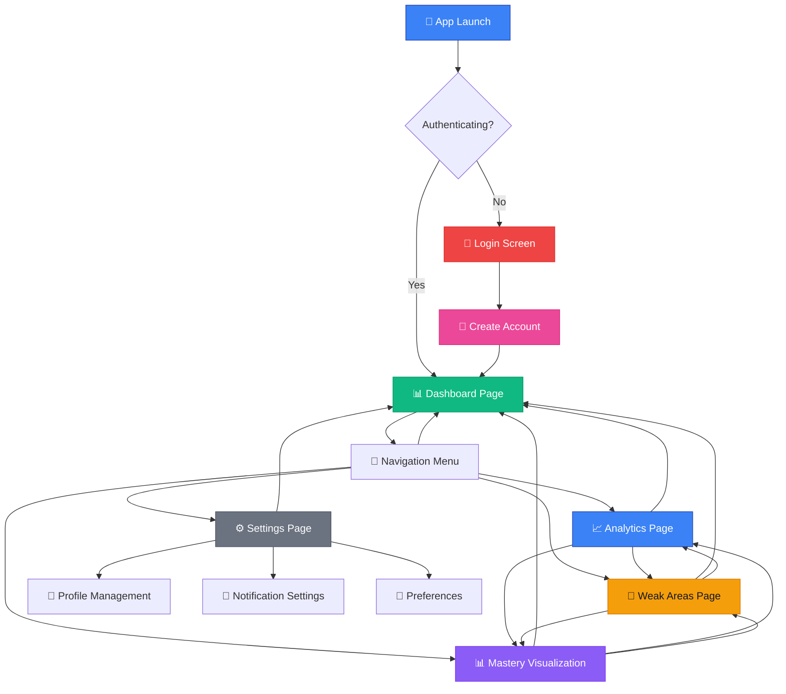
```mermaid
graph TD
    Start[🔑 App Launch] --> Auth{Authenticating?}
    Auth -->|Yes| Dashboard[📊 Dashboard Page]
    Auth -->|No| Login[🔐 Login Screen]
    Login --> Signup[📝 Create Account]
    Signup --> Dashboard
    
    Dashboard --> Nav[🧭 Navigation Menu]
    
    Nav --> Dashboard
    Nav --> Analytics[📈 Analytics Page]
    Nav --> WeakAreas[🎯 Weak Areas Page]
    Nav --> Mastery[📊 Mastery Visualization]
    Nav --> Settings[⚙️ Settings Page]
    
    Analytics --> Dashboard
    Analytics --> WeakAreas
    Analytics --> Mastery
    
    WeakAreas --> Dashboard
    WeakAreas --> Analytics
    WeakAreas --> Mastery
    
    Mastery --> Dashboard
    Mastery --> Analytics
    Mastery --> WeakAreas
    
    Settings --> Dashboard
    Settings --> Profile[👤 Profile Management]
    Settings --> Notifications[🔔 Notification Settings]
    Settings --> Preferences[🎨 Preferences]
    
    style Start fill:#3B82F6,stroke:#1E40AF,color:#FFFFFF
    style Dashboard fill:#10B981,stroke:#059669,color:#FFFFFF
    style Analytics fill:#3B82F6,stroke:#1E40AF,color:#FFFFFF
    style WeakAreas fill:#F59E0B,stroke:#D97706,color:#111827
    style Mastery fill:#8B5CF6,stroke:#7C3AED,color:#FFFFFF
    style Settings fill:#6B7280,stroke:#4B5563,color:#FFFFFF
    style Login fill:#EF4444,stroke:#DC2626,color:#FFFFFF
    style Signup fill:#EC4899,stroke:#DB2777,color:#FFFFFF
```

**Legend:**
- 🔑 **App Launch**: User opens the Smart Learn application
- 🔐 **Login Screen**: Authentication required
- 📊 **Dashboard Page**: Main landing page
- 📈 **Analytics Page**: Progress tracking and insights
- 🎯 **Weak Areas Page**: Improvement recommendations
- 📊 **Mastery Visualization**: Detailed mastery analytics
- ⚙️ **Settings Page**: Account and app configuration

---

## 2. Dashboard Interactions - Complete Workflow

### 2.1 Dashboard Main Interactions

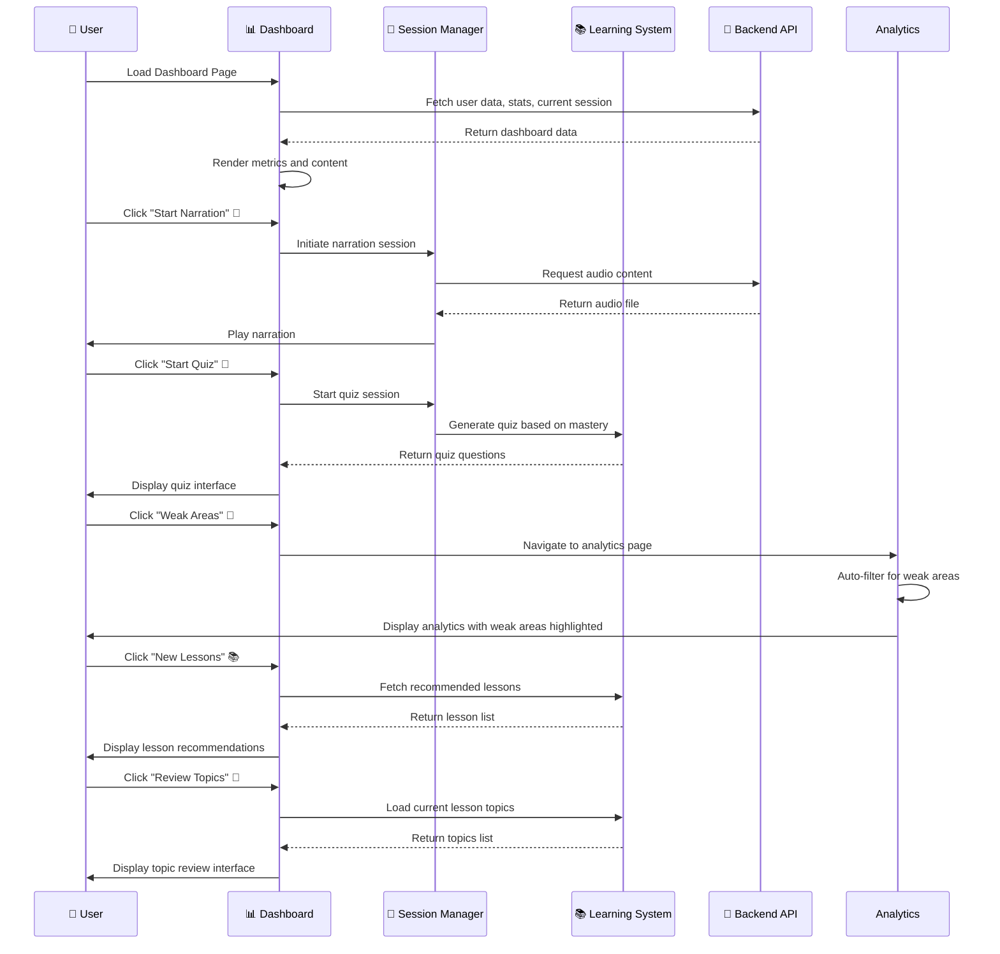
```mermaid
sequenceDiagram
    participant User as 👤 User
    participant Dashboard as 📊 Dashboard
    participant Session as 🎯 Session Manager
    participant Learning as 📚 Learning System
    participant API as 🔌 Backend API
    
    User->>Dashboard: Load Dashboard Page
    Dashboard->>API: Fetch user data, stats, current session
    API-->>Dashboard: Return dashboard data
    Dashboard->>Dashboard: Render metrics and content
    
    User->>Dashboard: Click "Start Narration" 🎵
    Dashboard->>Session: Initiate narration session
    Session->>API: Request audio content
    API-->>Session: Return audio file
    Session->>User: Play narration
    
    User->>Dashboard: Click "Start Quiz" 📝
    Dashboard->>Session: Start quiz session
    Session->>Learning: Generate quiz based on mastery
    Learning-->>Dashboard: Return quiz questions
    Dashboard->>User: Display quiz interface
    
    User->>Dashboard: Click "Weak Areas" 🎯
    Dashboard->>Analytics: Navigate to analytics page
    Analytics->>Analytics: Auto-filter for weak areas
    Analytics->>User: Display analytics with weak areas highlighted
    
    User->>Dashboard: Click "New Lessons" 📚
    Dashboard->>Learning: Fetch recommended lessons
    Learning-->>Dashboard: Return lesson list
    Dashboard->>User: Display lesson recommendations
    
    User->>Dashboard: Click "Review Topics" 📖
    Dashboard->>Learning: Load current lesson topics
    Learning-->>Dashboard: Return topics list
    Dashboard->>User: Display topic review interface
```

### 2.2 Metrics Cards Workflow

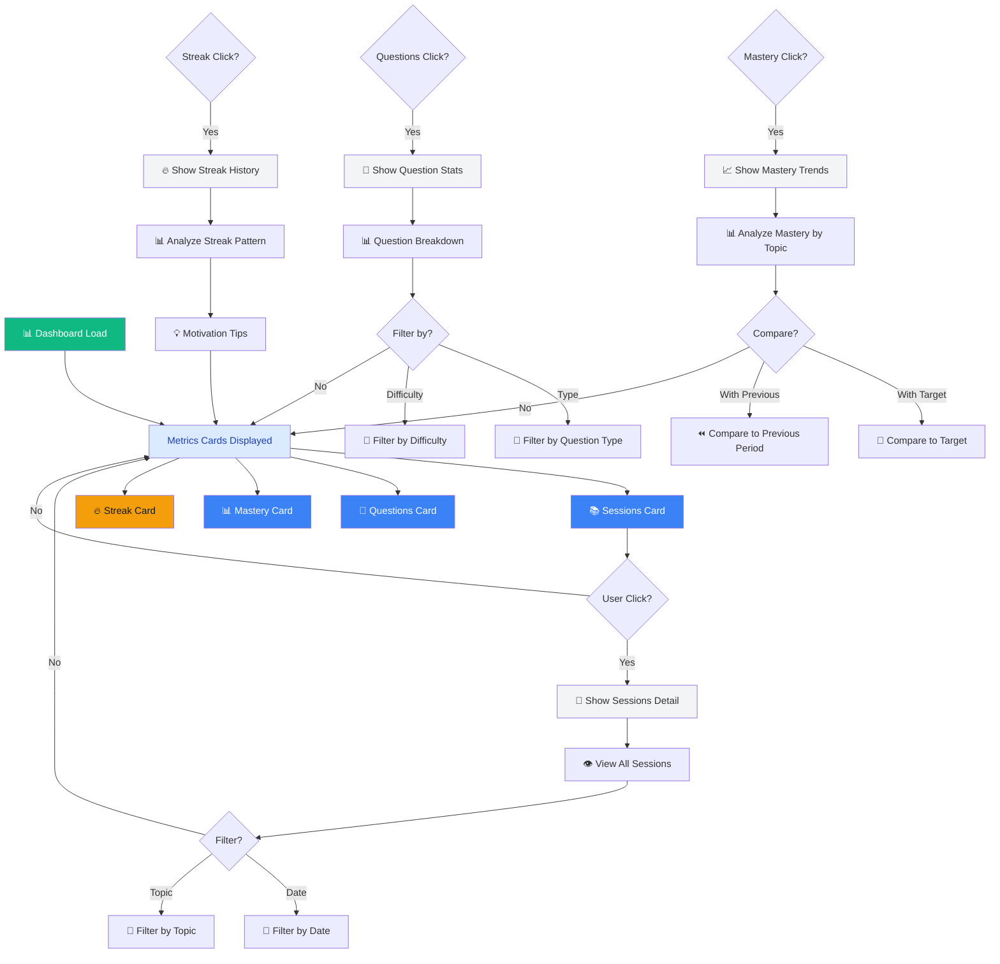
```mermaid
flowchart TD
    Dashboard[📊 Dashboard Load] --> Metrics[Metrics Cards Displayed]
    
    Metrics --> SessionsCard[📚 Sessions Card]
    Metrics --> QuestionsCard[📝 Questions Card]
    Metrics --> MasteryCard[📊 Mastery Card]
    Metrics --> StreakCard[🔥 Streak Card]
    
    SessionsCard --> SessionsClick{User Click?}
    SessionsClick -->|Yes| SessionsDetail[📅 Show Sessions Detail]
    SessionsClick -->|No| Metrics
    
    SessionsDetail --> SessionsView[👁️ View All Sessions]
    SessionsView --> SessionsFilter{Filter?}
    SessionsFilter -->|Date| SessionsByDate[📅 Filter by Date]
    SessionsFilter -->|Topic| SessionsByTopic[📖 Filter by Topic]
    SessionsFilter -->|No| Metrics
    
    QuestionsClick{Questions Click?} -->|Yes| QuestionsDetail[📝 Show Question Stats]
    QuestionsDetail --> QuestionsBreakdown[📊 Question Breakdown]
    QuestionsBreakdown --> QuestionsFilter{Filter by?}
    QuestionsFilter -->|Type| QByType[📝 Filter by Question Type]
    QuestionsFilter -->|Difficulty| QByDiff[🎯 Filter by Difficulty]
    QuestionsFilter -->|No| Metrics
    
    MasteryClick{Mastery Click?} -->|Yes| MasteryDetail[📈 Show Mastery Trends]
    MasteryDetail --> MasteryAnalysis[📊 Analyze Mastery by Topic]
    MasteryAnalysis --> MasteryCompare{Compare?}
    MasteryCompare -->|With Target| MCompTarget[🎯 Compare to Target]
    MasteryCompare -->|With Previous| MCompPrev[⏪ Compare to Previous Period]
    MasteryCompare -->|No| Metrics
    
    StreakClick{Streak Click?} -->|Yes| StreakDetail[🔥 Show Streak History]
    StreakDetail --> StreakAnalysis[📊 Analyze Streak Pattern]
    StreakAnalysis --> StreakTips[💡 Motivation Tips]
    StreakTips --> Metrics
    
    style Dashboard fill:#10B981,color:#FFFFFF
    style Metrics fill:#DBEAFE,color:#1E40AF
    style SessionsCard fill:#3B82F6,color:#FFFFFF
    style QuestionsCard fill:#3B82F6,color:#FFFFFF
    style MasteryCard fill:#3B82F6,color:#FFFFFF
    style StreakCard fill:#F59E0B,color:#111827
    style SessionsClick diamond
    style QuestionsClick diamond
    style MasteryClick diamond
    style StreakClick diamond
    style SessionsDetail fill:#F3F4F6
    style QuestionsDetail fill:#F3F4F6
    style MasteryDetail fill:#F3F4F6
    style StreakDetail fill:#F3F4F6
```

---

## 3. Session Management Flow

### 3.1 Learning Session Lifecycle

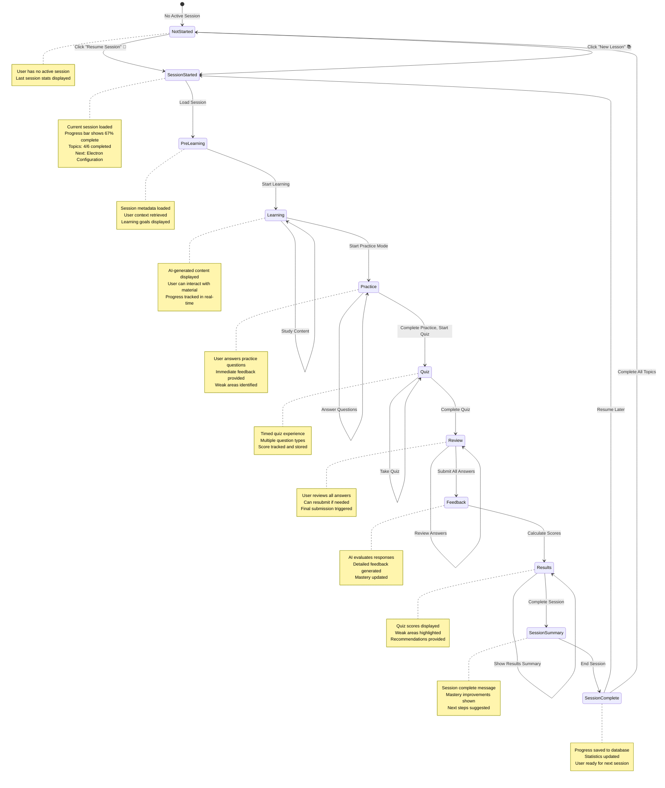
```mermaid
stateDiagram-v2
    [*] --> NotStarted: No Active Session
    
    NotStarted --> SessionStarted: Click "Resume Session" 🎵
    NotStarted --> SessionStarted: Click "New Lesson" 📚
    
    SessionStarted --> PreLearning: Load Session
    PreLearning --> Learning: Start Learning
    Learning --> Learning: Study Content
    Learning --> Practice: Start Practice Mode
    Practice --> Practice: Answer Questions
    Practice --> Quiz: Complete Practice, Start Quiz
    Quiz --> Quiz: Take Quiz
    Quiz --> Review: Complete Quiz
    
    Review --> Review: Review Answers
    Review --> Feedback: Submit All Answers
    Feedback --> Results: Calculate Scores
    
    Results --> Results: Show Results Summary
    Results --> SessionSummary: Complete Session
    
    SessionSummary --> SessionComplete: End Session
    
    SessionComplete --> SessionStarted: Resume Later
    SessionComplete --> NotStarted: Complete All Topics
    
    note right of NotStarted
        User has no active session
        Last session stats displayed
    end note
    
    note right of SessionStarted
        Current session loaded
        Progress bar shows 67% complete
        Topics: 4/6 completed
        Next: Electron Configuration
    end note
    
    note right of PreLearning
        Session metadata loaded
        User context retrieved
        Learning goals displayed
    end note
    
    note right of Learning
        AI-generated content displayed
        User can interact with material
        Progress tracked in real-time
    end note
    
    note right of Practice
        User answers practice questions
        Immediate feedback provided
        Weak areas identified
    end note
    
    note right of Quiz
        Timed quiz experience
        Multiple question types
        Score tracked and stored
    end note
    
    note right of Review
        User reviews all answers
        Can resubmit if needed
        Final submission triggered
    end note
    
    note right of Feedback
        AI evaluates responses
        Detailed feedback generated
        Mastery updated
    end note
    
    note right of Results
        Quiz scores displayed
        Weak areas highlighted
        Recommendations provided
    end note
    
    note right of SessionSummary
        Session complete message
        Mastery improvements shown
        Next steps suggested
    end note
    
    note right of SessionComplete
        Progress saved to database
        Statistics updated
        User ready for next session
    end note
```

### 3.2 Session State Transitions

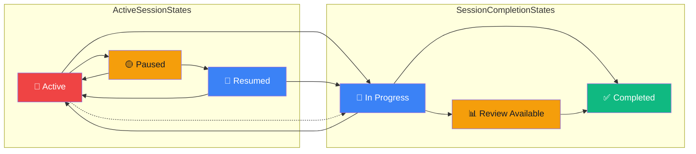
```mermaid
flowchart LR
    subgraph ActiveSessionStates
        A[🔴 Active] --> B[🟡 Paused]
        B --> A
        B --> C[🔵 Resumed]
        C --> A
    end
    
    subgraph SessionCompletionStates
        D[📝 In Progress] --> E[✅ Completed]
        A --> D
        C --> D
        D --> F[📊 Review Available]
        F --> E
    end
    
    A -.-> D
    D --> A
    
    style A fill:#EF4444,color:#FFFFFF
    style B fill:#F59E0B,color:#111827
    style C fill:#3B82F6,color:#FFFFFF
    style D fill:#3B82F6,color:#FFFFFF
    style E fill:#10B981,color:#FFFFFF
    style F fill:#F59E0B,color:#111827
```

---

## 4. Analytics Navigation Workflow

### 4.1 Analytics Page Main Flow

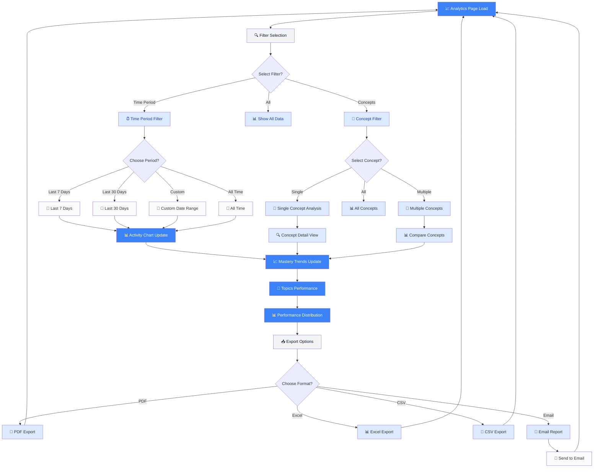
```mermaid
flowchart TD
    Analytics[📈 Analytics Page Load] --> FilterSelect[🔍 Filter Selection]
    
    FilterSelect --> FilterType{Select Filter?}
    FilterType -->|Time Period| PeriodFilter[⏰ Time Period Filter]
    FilterType -->|Concepts| ConceptFilter[🎯 Concept Filter]
    FilterType -->|All| AllFilter[📊 Show All Data]
    
    PeriodFilter --> PeriodSelection{Choose Period?}
    PeriodSelection -->|Last 7 Days| P7[📅 Last 7 Days]
    PeriodSelection -->|Last 30 Days| P30[📅 Last 30 Days]
    PeriodSelection -->|Custom| CustomPeriod[📅 Custom Date Range]
    PeriodSelection -->|All Time| AllTime[📅 All Time]
    
    P7 --> ActivityChart
    P30 --> ActivityChart
    CustomPeriod --> ActivityChart
    AllTime --> ActivityChart
    
    ActivityChart[📊 Activity Chart Update] --> MasteryTrends[📈 Mastery Trends Update]
    MasteryTrends --> TopicsTable[📝 Topics Performance]
    TopicsTable --> PerformanceDist[📊 Performance Distribution]
    
    ConceptFilter --> ConceptSelection{Select Concept?}
    ConceptSelection -->|Single| SingleConcept[🎯 Single Concept Analysis]
    ConceptSelection -->|Multiple| MultiConcept[🎯 Multiple Concepts]
    ConceptSelection -->|All| ShowAllConcepts[📊 All Concepts]
    
    SingleConcept --> ConceptDetail[🔍 Concept Detail View]
    MultiConcept --> ConceptCompare[📊 Compare Concepts]
    
    ConceptDetail --> MasteryTrends
    ConceptCompare --> MasteryTrends
    
    PerformanceDist --> ExportOptions[📥 Export Options]
    ExportOptions --> ExportType{Choose Format?}
    ExportType -->|PDF| ExportPDF[📄 PDF Export]
    ExportType -->|Excel| ExportExcel[📊 Excel Export]
    ExportType -->|CSV| ExportCSV[📝 CSV Export]
    ExportType -->|Email| ExportEmail[📧 Email Report]
    
    ExportPDF --> Analytics
    ExportExcel --> Analytics
    ExportCSV --> Analytics
    ExportEmail --> EmailSend[📨 Send to Email]
    EmailSend --> Analytics
    
    style Analytics fill:#3B82F6,color:#FFFFFF
    style FilterSelect fill:#F3F4F6,color:#111827
    style FilterType diamond
    style PeriodFilter fill:#DBEAFE,color:#1E40AF
    style ConceptFilter fill:#DBEAFE,color:#1E40AF
    style AllFilter fill:#DBEAFE,color:#1E40AF
    style PeriodSelection diamond
    style P7 fill:#F9FAFB
    style P30 fill:#F9FAFB
    style CustomPeriod fill:#F9FAFB
    style AllTime fill:#F9FAFB
    style ActivityChart fill:#3B82F6,color:#FFFFFF
    style MasteryTrends fill:#3B82F6,color:#FFFFFF
    style TopicsTable fill:#3B82F6,color:#FFFFFF
    style PerformanceDist fill:#3B82F6,color:#FFFFFF
    style ExportOptions fill:#F3F4F6,color:#111827
    style ExportType diamond
    style ExportPDF fill:#DBEAFE
    style ExportExcel fill:#DBEAFE
    style ExportCSV fill:#DBEAFE
    style ExportEmail fill:#DBEAFE
    style EmailSend fill:#F9FAFB
    style ConceptSelection diamond
    style SingleConcept fill:#DBEAFE
    style MultiConcept fill:#DBEAFE
    style ShowAllConcepts fill:#DBEAFE
    style ConceptDetail fill:#DBEAFE
    style ConceptCompare fill:#DBEAFE
```

### 4.2 Detailed Analytics Workflow

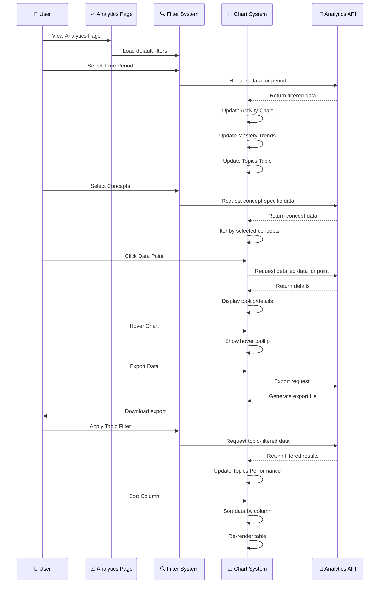
```mermaid
sequenceDiagram
    participant User as 👤 User
    participant Analytics as 📈 Analytics Page
    participant Filters as 🔍 Filter System
    participant Charts as 📊 Chart System
    participant API as 🔌 Analytics API
    
    User->>Analytics: View Analytics Page
    Analytics->>Filters: Load default filters
    
    User->>Filters: Select Time Period
    Filters->>API: Request data for period
    API-->>Charts: Return filtered data
    Charts->>Charts: Update Activity Chart
    Charts->>Charts: Update Mastery Trends
    Charts->>Charts: Update Topics Table
    
    User->>Filters: Select Concepts
    Filters->>API: Request concept-specific data
    API-->>Charts: Return concept data
    Charts->>Charts: Filter by selected concepts
    
    User->>Charts: Click Data Point
    Charts->>API: Request detailed data for point
    API-->>Charts: Return details
    Charts->>Charts: Display tooltip/details
    
    User->>Charts: Hover Chart
    Charts->>Charts: Show hover tooltip
    
    User->>Charts: Export Data
    Charts->>API: Export request
    API-->>Charts: Generate export file
    Charts->>User: Download export
    
    User->>Filters: Apply Topic Filter
    Filters->>API: Request topic-filtered data
    API-->>Charts: Return filtered results
    Charts->>Charts: Update Topics Performance
    
    User->>Charts: Sort Column
    Charts->>Charts: Sort data by column
    Charts->>Charts: Re-render table
```

---

## 5. Learning Session Deep Dive

### 5.1 Complete Learning Journey

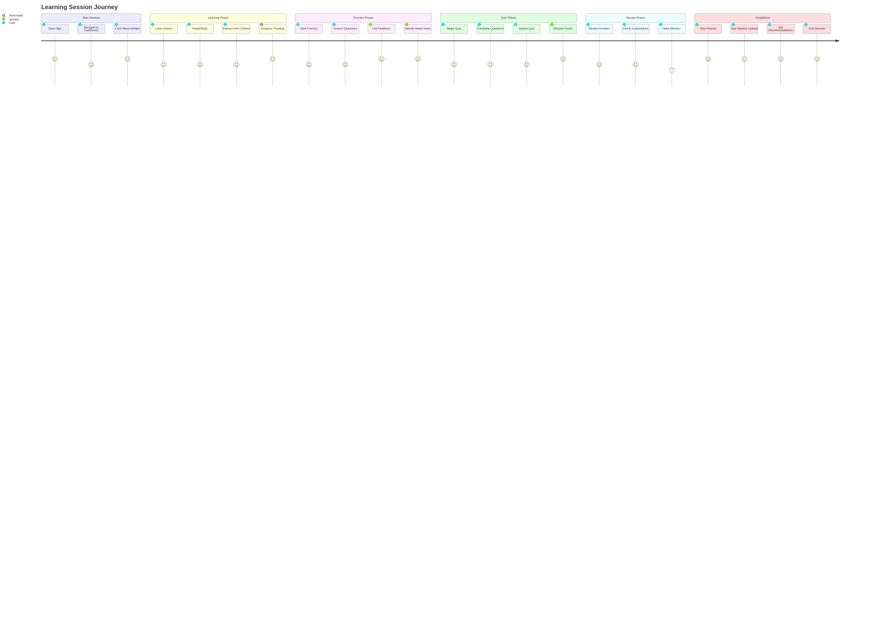
```mermaid
journey
    title Learning Session Journey
    section Start Session
      Open App: 5: User
      Navigate to Dashboard: 4: User
      Click Resume/New: 5: User
    section Learning Phase
      Load Content: 4: User
      Read/Study: 4: User
      Interact with Content: 4: User
      Progress Tracking: 5: Automated
    section Practice Phase
      Start Practice: 4: User
      Answer Questions: 4: User
      Get Feedback: 5: System
      Identify Weak Areas: 5: System
    section Quiz Phase
      Begin Quiz: 4: User
      Complete Questions: 4: User
      Submit Quiz: 4: User
      Receive Score: 5: System
    section Review Phase
      Review Answers: 4: User
      Check Explanations: 4: User
      Mark Mastery: 3: User
    section Completion
      View Results: 5: User
      See Mastery Update: 5: User
      Get Recommendations: 5: User
      End Session: 5: User
```

### 5.2 Content Interaction Workflow

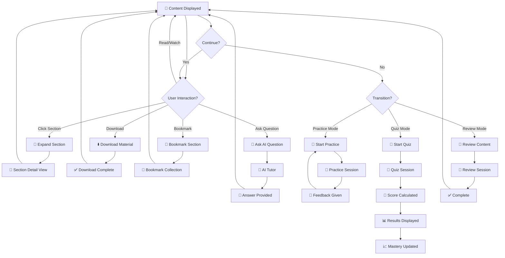
```mermaid
flowchart TD
    Content[📖 Content Displayed] --> Interaction{User Interaction?}
    
    Interaction -->|Read/Watch| Content
    Interaction -->|Click Section| ExpandSection[📂 Expand Section]
    Interaction -->|Download| Download[⬇️ Download Material]
    Interaction -->|Bookmark| Bookmark[🔖 Bookmark Section]
    Interaction -->|Ask Question| AskAI[🤖 Ask AI Question]
    
    ExpandSection --> SectionDetail[📄 Section Detail View]
    SectionDetail --> Content
    
    Download --> DownloadComplete[✅ Download Complete]
    DownloadComplete --> Content
    
    Bookmark --> BookmarkList[📑 Bookmark Collection]
    BookmarkList --> Content
    
    AskAI --> AIAssistant[🤖 AI Tutor]
    AIAssistant --> AIAnswer[💬 Answer Provided]
    AIAnswer --> Content
    
    Content --> QuestionTime{Continue?}
    QuestionTime -->|Yes| Interaction
    QuestionTime -->|No| PracticeTime{Transition?}
    
    PracticeTime -->|Practice Mode| PracticeMode[🎯 Start Practice]
    PracticeTime -->|Quiz Mode| QuizMode[📝 Start Quiz]
    PracticeTime -->|Review Mode| ReviewMode[📖 Review Content]
    
    PracticeMode --> PracticeSession[🎯 Practice Session]
    PracticeSession --> PracticeFeedback[💬 Feedback Given]
    PracticeFeedback --> PracticeMode
    
    QuizMode --> QuizSession[📝 Quiz Session]
    QuizSession --> QuizScore[🎯 Score Calculated]
    QuizScore --> QuizResults[📊 Results Displayed]
    QuizResults --> MasteryUpdate[📈 Mastery Updated]
    
    ReviewMode --> ReviewSession[📖 Review Session]
    ReviewSession --> ReviewComplete[✅ Complete]
    ReviewComplete --> Content
```

---

## 6. Weak Areas Remediation Workflow

### 6.1 Complete Weak Areas Flow

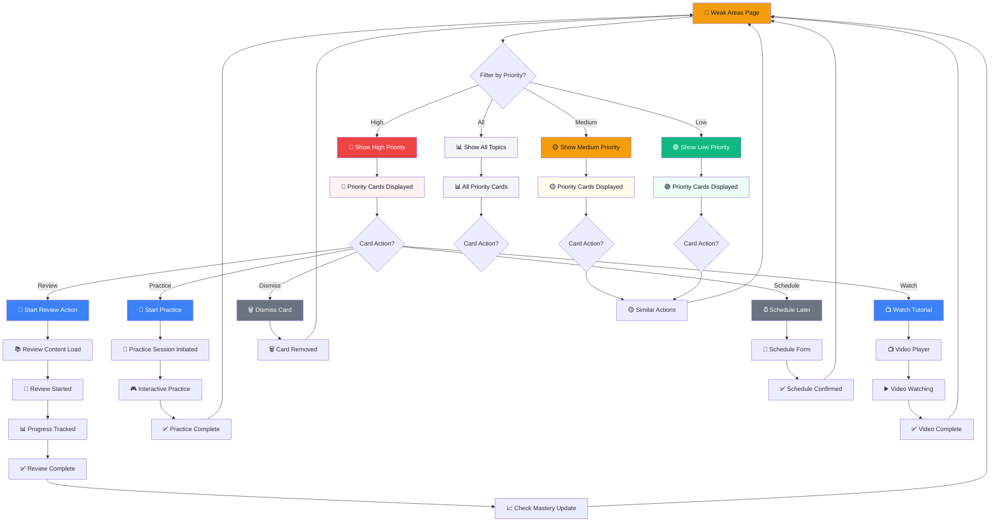
```mermaid
flowchart TD
    WeakAreas[🎯 Weak Areas Page] --> FilterPriority{Filter by Priority?}
    
    FilterPriority -->|High| ShowHigh[🔴 Show High Priority]
    FilterPriority -->|Medium| ShowMedium[🟡 Show Medium Priority]
    FilterPriority -->|Low| ShowLow[🟢 Show Low Priority]
    FilterPriority -->|All| ShowAll[📊 Show All Topics]
    
    ShowHigh --> HighCards[🔴 Priority Cards Displayed]
    ShowMedium --> MediumCards[🟡 Priority Cards Displayed]
    ShowLow --> LowCards[🟢 Priority Cards Displayed]
    ShowAll --> AllCards[📊 All Priority Cards]
    
    HighCards --> HighCardAction{Card Action?}
    MediumCards --> MediumCardAction{Card Action?}
    LowCards --> LowCardAction{Card Action?}
    AllCards --> AllCardAction{Card Action?}
    
    HighCardAction -->|Review| StartReview[📖 Start Review Action]
    HighCardAction -->|Practice| StartPractice[🎯 Start Practice]
    HighCardAction -->|Watch| StartVideo[📺 Watch Tutorial]
    HighCardAction -->|Dismiss| DismissCard[🗑️ Dismiss Card]
    HighCardAction -->|Schedule| ScheduleLater[⏰ Schedule Later]
    
    StartReview --> ReviewContent[📚 Review Content Load]
    ReviewContent --> ReviewStart[🎯 Review Started]
    ReviewStart --> ReviewProgress[📊 Progress Tracked]
    ReviewProgress --> ReviewComplete[✅ Review Complete]
    ReviewComplete --> MasteryCheck[📈 Check Mastery Update]
    MasteryCheck --> WeakAreas
    
    StartPractice --> PracticeSession[🎯 Practice Session Initiated]
    PracticeSession --> PracticeInteractive[🎮 Interactive Practice]
    PracticeInteractive --> PracticeComplete[✅ Practice Complete]
    PracticeComplete --> WeakAreas
    
    StartVideo --> VideoPlayer[📺 Video Player]
    VideoPlayer --> VideoWatch[▶️ Video Watching]
    VideoWatch --> VideoComplete[✅ Video Complete]
    VideoComplete --> WeakAreas
    
    DismissCard --> CardRemoved[🗑️ Card Removed]
    CardRemoved --> WeakAreas
    
    ScheduleLater --> ScheduleForm[📅 Schedule Form]
    ScheduleForm --> ScheduleConfirm[✅ Schedule Confirmed]
    ScheduleConfirm --> WeakAreas
    
    MediumCardAction --> SimilarActions[🟡 Similar Actions]
    LowCardAction --> SimilarActions
    
    SimilarActions --> WeakAreas
    
    style WeakAreas fill:#F59E0B,color:#111827
    style FilterPriority diamond
    style ShowHigh fill:#EF4444,color:#FFFFFF
    style ShowMedium fill:#F59E0B,color:#111827
    style ShowLow fill:#10B981,color:#FFFFFF
    style ShowAll fill:#F3F4F6,color:#111827
    style HighCards fill:#FEF2F2,color:#111827
    style MediumCards fill:#FFFBEB,color:#111827
    style LowCards fill:#ECFDF5,color:#111827
    style AllCards fill:#F3F4F6,color:#111827
    style HighCardAction diamond
    style MediumCardAction diamond
    style LowCardAction diamond
    style AllCardAction diamond
    style StartReview fill:#3B82F6,color:#FFFFFF
    style StartPractice fill:#3B82F6,color:#FFFFFF
    style StartVideo fill:#3B82F6,color:#FFFFFF
    style DismissCard fill:#6B7280,color:#FFFFFF
    style ScheduleLater fill:#6B7280,color:#FFFFFF
```

### 6.2 Action Plan Workflow

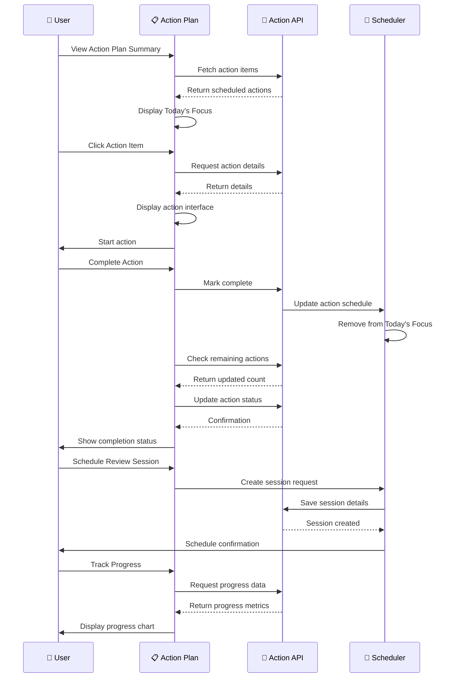
```mermaid
sequenceDiagram
    participant User as 👤 User
    participant ActionPlan as 📋 Action Plan
    participant API as 🔌 Action API
    participant Scheduler as 📅 Scheduler
    
    User->>ActionPlan: View Action Plan Summary
    ActionPlan->>API: Fetch action items
    
    API-->>ActionPlan: Return scheduled actions
    ActionPlan->>ActionPlan: Display Today's Focus
    
    User->>ActionPlan: Click Action Item
    ActionPlan->>API: Request action details
    API-->>ActionPlan: Return details
    
    ActionPlan->>ActionPlan: Display action interface
    ActionPlan->>User: Start action
    
    User->>ActionPlan: Complete Action
    ActionPlan->>API: Mark complete
    API->>Scheduler: Update action schedule
    Scheduler->>Scheduler: Remove from Today's Focus
    
    ActionPlan->>API: Check remaining actions
    API-->>ActionPlan: Return updated count
    
    ActionPlan->>API: Update action status
    API-->>ActionPlan: Confirmation
    ActionPlan->>User: Show completion status
    
    User->>ActionPlan: Schedule Review Session
    ActionPlan->>Scheduler: Create session request
    Scheduler->>API: Save session details
    API-->>Scheduler: Session created
    Scheduler->>User: Schedule confirmation
    
    User->>ActionPlan: Track Progress
    ActionPlan->>API: Request progress data
    API-->>ActionPlan: Return progress metrics
    ActionPlan->>User: Display progress chart
```

---

## 7. Mastery Visualization Workflow

### 7.1 Mastery Detail Workflow

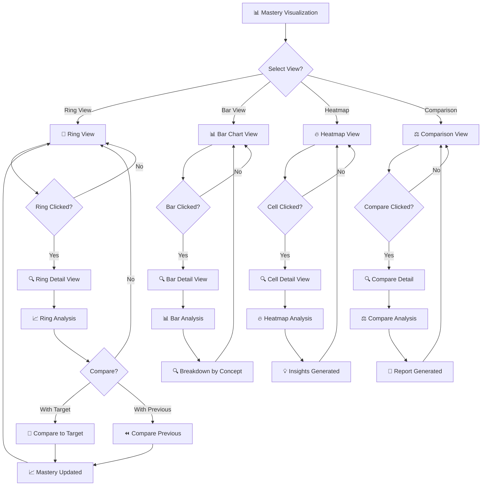
```mermaid
flowchart TD
    Mastery[📊 Mastery Visualization] --> ViewSelection{Select View?}
    
    ViewSelection -->|Ring View| RingView[🔄 Ring View]
    ViewSelection -->|Bar View| BarView[📊 Bar Chart View]
    ViewSelection -->|Heatmap| HeatmapView[🔥 Heatmap View]
    ViewSelection -->|Comparison| ComparisonView[⚖️ Comparison View]
    
    RingView --> RingClick{Ring Clicked?}
    BarView --> BarClick{Bar Clicked?}
    HeatmapView --> HeatmapClick{Cell Clicked?}
    ComparisonView --> CompareClick{Compare Clicked?}
    
    RingClick -->|Yes| RingDetail[🔍 Ring Detail View]
    RingClick -->|No| RingView
    BarClick -->|Yes| BarDetail[🔍 Bar Detail View]
    BarClick -->|No| BarView
    HeatmapClick -->|Yes| HeatmapDetail[🔍 Cell Detail View]
    HeatmapClick -->|No| HeatmapView
    CompareClick -->|Yes| CompareDetail[🔍 Compare Detail]
    CompareClick -->|No| ComparisonView
    
    RingDetail --> RingAnalysis[📈 Ring Analysis]
    RingAnalysis --> RingCompare{Compare?}
    RingCompare -->|With Target| RingTarget[🎯 Compare to Target]
    RingCompare -->|With Previous| RingPrev[⏪ Compare Previous]
    RingCompare -->|No| RingView
    
    RingTarget --> RingUpdate[📈 Mastery Updated]
    RingPrev --> RingUpdate
    RingUpdate --> RingView
    
    BarDetail --> BarAnalysis[📊 Bar Analysis]
    BarAnalysis --> BarBreakdown[🔍 Breakdown by Concept]
    BarBreakdown --> BarView
    
    HeatmapDetail --> HeatmapAnalysis[🔥 Heatmap Analysis]
    HeatmapAnalysis --> HeatmapInsights[💡 Insights Generated]
    HeatmapInsights --> HeatmapView
    
    CompareDetail --> CompareAnalysis[⚖️ Compare Analysis]
    CompareAnalysis --> CompareReport[📄 Report Generated]
    CompareReport --> ComparisonView
```

### 7.2 Mastery Trend Analysis

```mermaid
flowchart LR
    subgraph TrendAnalysis
        A[Mastery Data] --> TrendLine[📈 Trend Line]
        TrendLine --> TargetLine[🎯 Target Line]
        TargetLine --> Comparison[⚖️ Comparison]
        Comparison --> TrendAnalysis
    end
    
    subgraph ComparisonTypes
        B[Current vs Previous] --> DiffCalc[📊 Calculate Difference]
        C[Current vs Target] --> GapAnalysis[🔍 Gap Analysis]
        D[Historical Trend] --> PatternRec[🎯 Pattern Recognition]
    end
    
    TrendAnalysis --> ComparisonTypes
    ComparisonTypes --> Insights[💡 Insights Generated]
    Insights --> Recommendations[🎯 Recommendations]
    Recommendations --> Dashboard[📊 Update Dashboard]
    
    style TrendAnalysis fill:#3B82F6,color:#FFFFFF
    style ComparisonTypes fill:#DBEAFE,color:#1E40AF
    style Insights fill:#F59E0B,color:#111827
    style Recommendations fill:#10B981,color:#FFFFFF
    style Dashboard fill:#3B82F6,color:#FFFFFF
```

---

## 8. Settings & Configuration Flow

### 8.1 Account Management Workflow

```mermaid
flowchart TD
    Settings[⚙️ Settings Page] --> AccountSettings[👤 Account Settings]
    Settings --> Notifications[🔔 Notification Settings]
    Settings --> Preferences[🎨 Preferences]
    Settings --> Privacy[🔒 Privacy Settings]
    Settings --> Integration[🔗 Integration Settings]
    
    AccountSettings --> ProfileEdit[✏️ Edit Profile]
    ProfileEdit --> ProfileView[👤 View Profile]
    ProfileEdit --> ProfileUpdate[✅ Update Profile]
    ProfileUpdate --> Settings
    
    AccountSettings --> PasswordChange[🔑 Change Password]
    PasswordChange --> PasswordConfirm[🔐 Confirm Current]
    PasswordConfirm --> NewPassword[🆕 New Password]
    NewPassword --> PasswordUpdate[✅ Update Password]
    PasswordUpdate --> Settings
    
    AccountSettings --> Subscription[💳 Subscription]
    Subscription --> PlanView[📊 Current Plan]
    PlanView --> PlanChange[🔄 Change Plan]
    PlanChange --> Payment[💳 Payment Method]
    Payment --> PlanUpdate[✅ Plan Updated]
    PlanUpdate --> Subscription
    PlanUpdate --> Settings
    
    Notifications --> NotifToggle[🔔 Toggle Notifications]
    NotifToggle --> NotifConfig[⚙️ Configure Notifications]
    NotifConfig --> EmailPrefs[📧 Email Preferences]
    NotifConfig --> PushPrefs[📱 Push Preferences]
    NotifConfig --> InAppPrefs[💬 In-App Preferences]
    EmailPrefs --> Settings
    PushPrefs --> Settings
    InAppPrefs --> Settings
    
    Preferences --> ThemePrefs[🎨 Theme Preferences]
    ThemePrefs --> ThemeToggle[🌓 Light/Dark Mode]
    ThemePrefs --> ColorPrefs[🌈 Color Scheme]
    ColorPrefs --> ThemeApply[✅ Apply Theme]
    ThemeApply --> Settings
    
    Preferences --> LanguagePrefs[🌐 Language Preferences]
    LanguagePrefs --> LanguageSelect[🌍 Select Language]
    LanguageSelect --> LanguageApply[✅ Apply Language]
    LanguageApply --> Settings
    
    Privacy --> PrivacyToggle[🔒 Privacy Controls]
    PrivacyToggle --> DataControls[📊 Data Controls]
    DataControls --> ExportData[📥 Export My Data]
    DataControls --> DeleteData[🗑️ Delete Data]
    ExportData --> Settings
    DeleteData --> Settings
    
    Integration --> APIKeys[🔑 API Keys]
    APIKeys --> KeyGenerate[🆕 Generate New Key]
    KeyGenerate --> KeySave[✅ Save Key]
    KeySave --> Settings
    
    Integration --> OAuth[🔗 OAuth Services]
    OAuth --> GoogleConnect[🔗 Connect Google]
    OAuth --> DropboxConnect[🔗 Connect Dropbox]
    OAuth --> OneDriveConnect[🔗 Connect OneDrive]
    GoogleConnect --> Settings
    DropboxConnect --> Settings
    OneDriveConnect --> Settings
    
    style Settings fill:#6B7280,color:#FFFFFF
    style AccountSettings fill:#3B82F6,color:#FFFFFF
    style Notifications fill:#3B82F6,color:#FFFFFF
    style Preferences fill:#3B82F6,color:#FFFFFF
    style Privacy fill:#3B82F6,color:#FFFFFF
    style Integration fill:#3B82F6,color:#FFFFFF
    style ProfileEdit fill:#F9FAFB
    style PasswordChange fill:#F9FAFB
    style Subscription fill:#F9FAFB
    style NotifToggle fill:#F9FAFB
    style ThemePrefs fill:#F9FAFB
    style LanguagePrefs fill:#F9FAFB
    style PrivacyToggle fill:#F9FAFB
    style APIKeys fill:#F9FAFB
    style OAuth fill:#F9FAFB
```

---

## 9. Cross-Page Workflows

### 9.1 Data Export and Sharing Flow

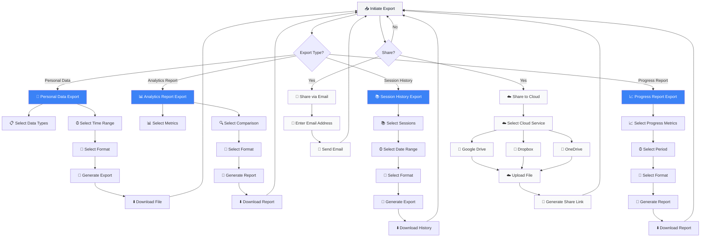
```mermaid
flowchart TD
    ExportInit[📥 Initiate Export] --> ExportType{Export Type?}
    
    ExportType -->|Personal Data| PersonalExport[👤 Personal Data Export]
    ExportType -->|Analytics Report| AnalyticsExport[📊 Analytics Report Export]
    ExportType -->|Session History| SessionExport[📚 Session History Export]
    ExportType -->|Progress Report| ProgressExport[📈 Progress Report Export]
    
    PersonalExport --> PersonalSelect[📋 Select Data Types]
    PersonalExport --> TimeRange[⏰ Select Time Range]
    TimeRange --> PersonalFormat[📄 Select Format]
    PersonalFormat --> PersonalGenerate[🔧 Generate Export]
    PersonalGenerate --> PersonalDownload[⬇️ Download File]
    PersonalDownload --> ExportInit
    
    AnalyticsExport --> AnalyticsSelect[📊 Select Metrics]
    AnalyticsExport --> AnalyticsCompare[🔍 Select Comparison]
    AnalyticsCompare --> AnalyticsFormat[📄 Select Format]
    AnalyticsFormat --> AnalyticsGenerate[🔧 Generate Report]
    AnalyticsGenerate --> AnalyticsDownload[⬇️ Download Report]
    AnalyticsDownload --> ExportInit
    
    SessionExport --> SessionSelect[📚 Select Sessions]
    SessionSelect --> SessionDate[⏰ Select Date Range]
    SessionDate --> SessionFormat[📄 Select Format]
    SessionFormat --> SessionGenerate[🔧 Generate Export]
    SessionGenerate --> SessionDownload[⬇️ Download History]
    SessionDownload --> ExportInit
    
    ProgressExport --> ProgressSelect[📈 Select Progress Metrics]
    ProgressSelect --> ProgressPeriod[⏰ Select Period]
    ProgressPeriod --> ProgressFormat[📄 Select Format]
    ProgressFormat --> ProgressGenerate[🔧 Generate Report]
    ProgressGenerate --> ProgressDownload[⬇️ Download Report]
    ProgressDownload --> ExportInit
    
    ExportInit --> ShareOptions{Share?}
    ShareOptions -->|Yes| ShareEmail[📧 Share via Email]
    ShareOptions -->|Yes| ShareCloud[☁️ Share to Cloud]
    ShareOptions -->|No| ExportInit
    
    ShareEmail --> EmailInput[📧 Enter Email Address]
    EmailInput --> EmailSend[📨 Send Email]
    EmailSend --> ExportInit
    
    ShareCloud --> CloudSelect[☁️ Select Cloud Service]
    CloudSelect --> GoogleDrive[🔗 Google Drive]
    CloudSelect --> Dropbox[🔗 Dropbox]
    CloudSelect --> OneDrive[🔗 OneDrive]
    GoogleDrive --> CloudUpload[☁️ Upload File]
    Dropbox --> CloudUpload
    OneDrive --> CloudUpload
    CloudUpload --> CloudLink[🔗 Generate Share Link]
    CloudLink --> ExportInit
    
    style ExportInit fill:#F3F4F6,color:#111827
    style ExportType diamond
    style PersonalExport fill:#3B82F6,color:#FFFFFF
    style AnalyticsExport fill:#3B82F6,color:#FFFFFF
    style SessionExport fill:#3B82F6,color:#FFFFFF
    style ProgressExport fill:#3B82F6,color:#FFFFFF
    style ShareOptions diamond
    style ShareEmail fill:#F9FAFB
    style ShareCloud fill:#F9FAFB
    style EmailInput fill:#F9FAFB
    style EmailSend fill:#F9FAFB
    style CloudSelect fill:#F9FAFB
    style GoogleDrive fill:#F9FAFB
    style Dropbox fill:#F9FAFB
    style OneDrive fill:#F9FAFB
    style CloudUpload fill:#F9FAFB
    style CloudLink fill:#F9FAFB
```

### 9.2 Learning Recommendation Engine Flow

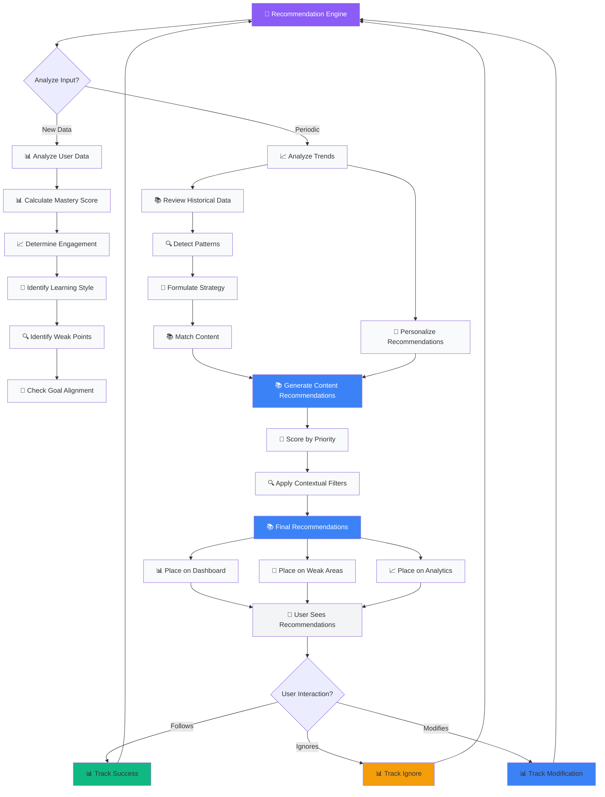
```mermaid
flowchart TD
    RecEngine[🤖 Recommendation Engine] --> InputAnalysis{Analyze Input?}
    
    InputAnalysis -->|New Data| AnalyzeData[📊 Analyze User Data]
    InputAnalysis -->|Periodic| AnalyzeTrends[📈 Analyze Trends]
    
    AnalyzeData --> MasteryScore[📊 Calculate Mastery Score]
    MasteryScore --> EngagementLevel[📈 Determine Engagement]
    EngagementLevel --> LearningStyle[🎯 Identify Learning Style]
    LearningStyle --> WeakPoints[🔍 Identify Weak Points]
    WeakPoints --> GoalAlignment[🎯 Check Goal Alignment]
    
    AnalyzeTrends --> HistoricalData[📚 Review Historical Data]
    HistoricalData --> PatternDetection[🔍 Detect Patterns]
    PatternDetection --> RecommendationStrategy[🎯 Formulate Strategy]
    
    RecommendationStrategy --> ContentMatching[📚 Match Content]
    ContentMatching --> ContentRecs[📚 Generate Content Recommendations]
    
    AnalyzeTrends --> Personalization[🎨 Personalize Recommendations]
    Personalization --> ContentRecs
    
    ContentRecs --> PriorityScoring[🔢 Score by Priority]
    PriorityScoring --> ContextualFilter[🔍 Apply Contextual Filters]
    ContextualFilter --> FinalRecs[📚 Final Recommendations]
    
    FinalRecs --> DashboardPlacement[📊 Place on Dashboard]
    FinalRecs --> WeakAreasPlacement[🎯 Place on Weak Areas]
    FinalRecs --> AnalyticsPlacement[📈 Place on Analytics]
    
    DashboardPlacement --> UserSees[👤 User Sees Recommendations]
    WeakAreasPlacement --> UserSees
    AnalyticsPlacement --> UserSees
    
    UserSees --> UserAction{User Interaction?}
    UserAction -->|Follows| TrackSuccess[📊 Track Success]
    UserAction -->|Ignores| TrackIgnore[📊 Track Ignore]
    UserAction -->|Modifies| TrackModify[📊 Track Modification]
    
    TrackSuccess --> RecEngine
    TrackIgnore --> RecEngine
    TrackModify --> RecEngine
    
    style RecEngine fill:#8B5CF6,color:#FFFFFF
    style InputAnalysis diamond
    style AnalyzeData fill:#F9FAFB
    style AnalyzeTrends fill:#F9FAFB
    style MasteryScore fill:#F9FAFB
    style EngagementLevel fill:#F9FAFB
    style LearningStyle fill:#F9FAFB
    style WeakPoints fill:#F9FAFB
    style GoalAlignment fill:#F9FAFB
    style HistoricalData fill:#F9FAFB
    style PatternDetection fill:#F9FAFB
    style RecommendationStrategy fill:#F9FAFB
    style ContentMatching fill:#F9FAFB
    style ContentRecs fill:#3B82F6,color:#FFFFFF
    style Personalization fill:#F9FAFB
    style PriorityScoring fill:#F9FAFB
    style ContextualFilter fill:#F9FAFB
    style FinalRecs fill:#3B82F6,color:#FFFFFF
    style DashboardPlacement fill:#F9FAFB
    style WeakAreasPlacement fill:#F9FAFB
    style AnalyticsPlacement fill:#F9FAFB
    style UserSees fill:#F3F4F6
    style UserAction diamond
    style TrackSuccess fill:#10B981
    style TrackIgnore fill:#F59E0B
    style TrackModify fill:#3B82F6
```

### 9.3 Notification System Flow

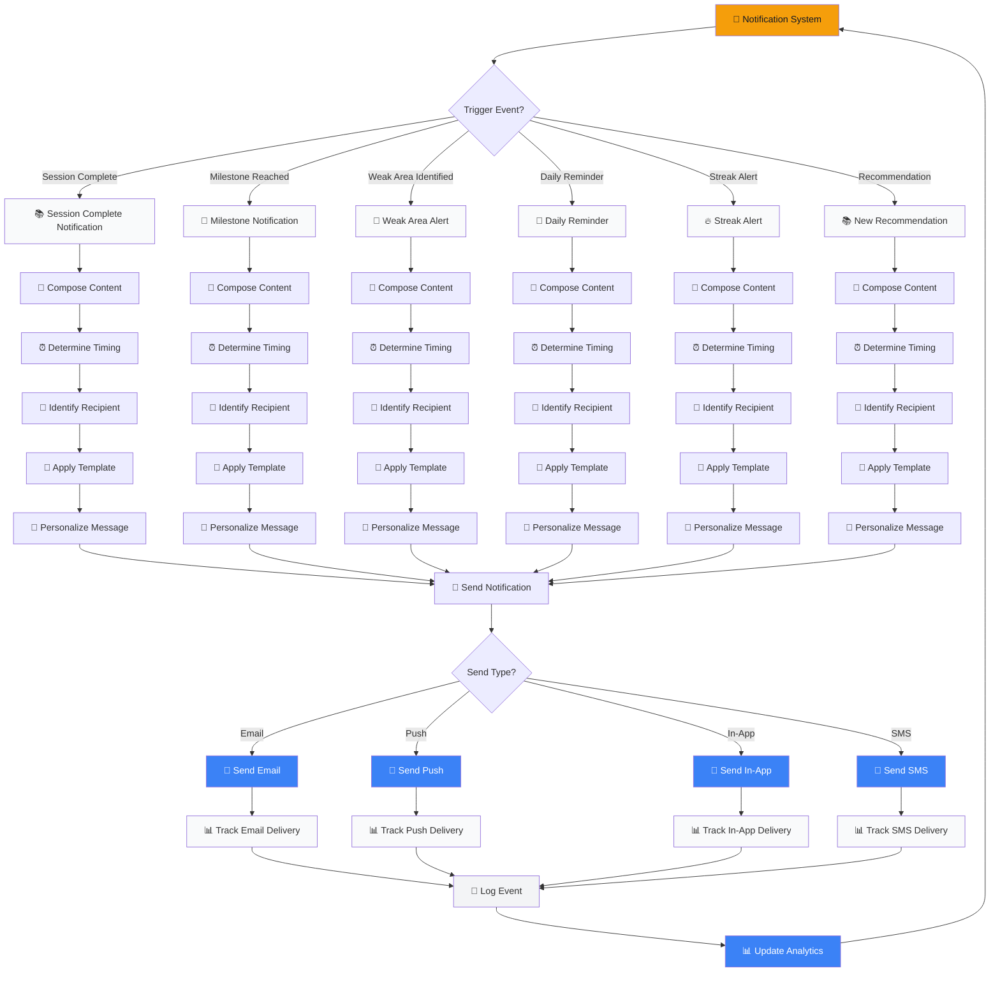
```mermaid
flowchart TD
    NotifySystem[🔔 Notification System] --> TriggerCheck{Trigger Event?}
    
    TriggerCheck -->|Session Complete| NotifyComplete[📚 Session Complete Notification]
    TriggerCheck -->|Milestone Reached| NotifyMilestone[🎯 Milestone Notification]
    TriggerCheck -->|Weak Area Identified| NotifyWeak[🎯 Weak Area Alert]
    TriggerCheck -->|Daily Reminder| NotifyDaily[📅 Daily Reminder]
    TriggerCheck -->|Streak Alert| NotifyStreak[🔥 Streak Alert]
    TriggerCheck -->|Recommendation| NotifyRec[📚 New Recommendation]
    
    NotifyComplete --> CC_Content[📧 Compose Content]
    CC_Content --> CC_Time[⏰ Determine Timing]
    CC_Time --> CC_Recipient[👤 Identify Recipient]
    CC_Recipient --> CC_Template[📝 Apply Template]
    CC_Template --> CC_Personalize[🎨 Personalize Message]
    CC_Personalize --> Send
    
    NotifyMilestone --> CM_Content[📧 Compose Content]
    CM_Content --> CM_Time[⏰ Determine Timing]
    CM_Time --> CM_Recipient[👤 Identify Recipient]
    CM_Recipient --> CM_Template[📝 Apply Template]
    CM_Template --> CM_Personalize[🎨 Personalize Message]
    CM_Personalize --> Send
    
    NotifyWeak --> CW_Content[📧 Compose Content]
    CW_Content --> CW_Time[⏰ Determine Timing]
    CW_Time --> CW_Recipient[👤 Identify Recipient]
    CW_Recipient --> CW_Template[📝 Apply Template]
    CW_Template --> CW_Personalize[🎨 Personalize Message]
    CW_Personalize --> Send
    
    NotifyDaily --> CD_Content[📧 Compose Content]
    CD_Content --> CD_Time[⏰ Determine Timing]
    CD_Time --> CD_Recipient[👤 Identify Recipient]
    CD_Recipient --> CD_Template[📝 Apply Template]
    CD_Template --> CD_Personalize[🎨 Personalize Message]
    CD_Personalize --> Send
    
    NotifyStreak --> CS_Content[📧 Compose Content]
    CS_Content --> CS_Time[⏰ Determine Timing]
    CS_Time --> CS_Recipient[👤 Identify Recipient]
    CS_Recipient --> CS_Template[📝 Apply Template]
    CS_Template --> CS_Personalize[🎨 Personalize Message]
    CS_Personalize --> Send
    
    NotifyRec --> CR_Content[📧 Compose Content]
    CR_Content --> CR_Time[⏰ Determine Timing]
    CR_Time --> CR_Recipient[👤 Identify Recipient]
    CR_Recipient --> CR_Template[📝 Apply Template]
    CR_Template --> CR_Personalize[🎨 Personalize Message]
    CR_Personalize --> Send
    
    Send[📨 Send Notification] --> NotificationType{Send Type?}
    NotificationType -->|Email| EmailSend[📧 Send Email]
    NotificationType -->|Push| PushSend[📱 Send Push]
    NotificationType -->|In-App| InAppSend[💬 Send In-App]
    NotificationType -->|SMS| SMSSend[📱 Send SMS]
    
    EmailSend --> TrackEmail[📊 Track Email Delivery]
    PushSend --> TrackPush[📊 Track Push Delivery]
    InAppSend --> TrackInApp[📊 Track In-App Delivery]
    SMSSend --> TrackSMS[📊 Track SMS Delivery]
    
    TrackEmail --> LogEvent[📝 Log Event]
    TrackPush --> LogEvent
    TrackInApp --> LogEvent
    TrackSMS --> LogEvent
    
    LogEvent --> Analytics[📊 Update Analytics]
    Analytics --> NotifySystem
    
    style NotifySystem fill:#F59E0B,color:#111827
    style TriggerCheck diamond
    style NotifyComplete fill:#F9FAFB
    style NotifyMilestone fill:#F9FAFB
    style NotifyWeak fill:#F9FAFB
    style NotifyDaily fill:#F9FAFB
    style NotifyStreak fill:#F9FAFB
    style NotifyRec fill:#F9FAFB
    style Send diamond
    style EmailSend fill:#3B82F6,color:#FFFFFF
    style PushSend fill:#3B82F6,color:#FFFFFF
    style InAppSend fill:#3B82F6,color:#FFFFFF
    style SMSSend fill:#3B82F6,color:#FFFFFF
    style NotificationType diamond
    style TrackEmail fill:#F9FAFB
    style TrackPush fill:#F9FAFB
    style TrackInApp fill:#F9FAFB
    style TrackSMS fill:#F9FAFB
    style LogEvent fill:#F3F4F6
    style Analytics fill:#3B82F6,color:#FFFFFF
```

---

## 10. Error Handling & Recovery Workflows

### 10.1 Error Recovery Flow

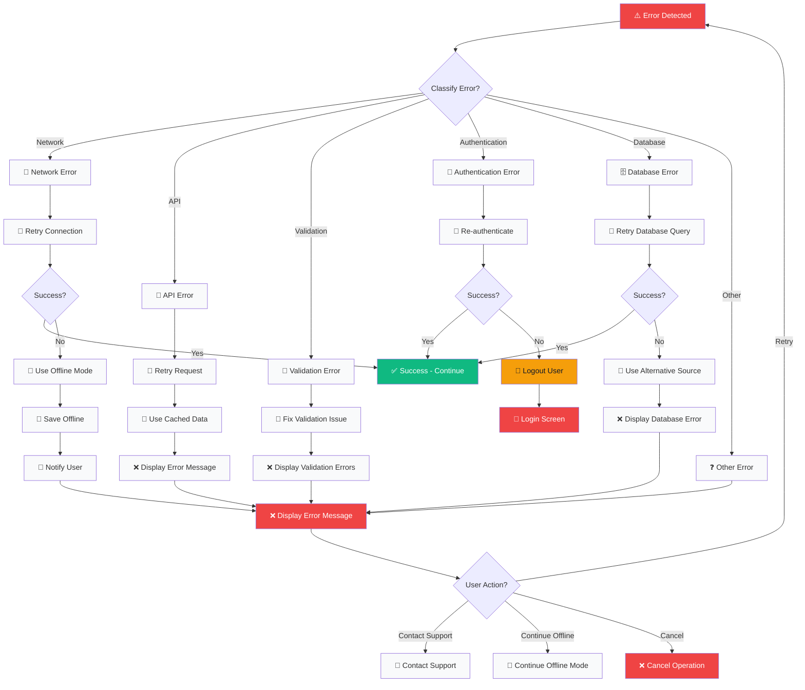
```mermaid
flowchart TD
    ErrorStart[⚠️ Error Detected] --> ErrorClassify{Classify Error?}
    
    ErrorClassify -->|Network| NetworkError[🔌 Network Error]
    ErrorClassify -->|API| APIError[🔌 API Error]
    ErrorClassify -->|Validation| ValidationError[📝 Validation Error]
    ErrorClassify -->|Authentication| AuthError[🔐 Authentication Error]
    ErrorClassify -->|Database| DBError[🗄️ Database Error]
    ErrorClassify -->|Other| OtherError[❓ Other Error]
    
    NetworkError --> NetworkRetry[🔄 Retry Connection]
    NetworkRetry --> NetworkSuccess{Success?}
    NetworkSuccess -->|Yes| Success[✅ Success - Continue]
    NetworkSuccess -->|No| NetworkFallback[🔄 Use Offline Mode]
    NetworkFallback --> NetworkState[💾 Save Offline]
    NetworkState --> NetworkAlert[📡 Notify User]
    
    APIError --> APIRetry[🔄 Retry Request]
    APIRetry --> APIFallback[🔄 Use Cached Data]
    APIFallback --> APIErrorDisplay[❌ Display Error Message]
    
    ValidationError --> ValidateFix[🔧 Fix Validation Issue]
    ValidateFix --> ValidationErrorDisplay[❌ Display Validation Errors]
    
    AuthError --> AuthRetry[🔄 Re-authenticate]
    AuthRetry --> AuthSuccess{Success?}
    AuthSuccess -->|Yes| Success
    AuthSuccess -->|No| Logout[🚪 Logout User]
    Logout --> LoginRequired[🔐 Login Screen]
    
    DBError --> DBRetry[🔄 Retry Database Query]
    DBRetry --> DBSuccess{Success?}
    DBSuccess -->|Yes| Success
    DBSuccess -->|No| DBFallback[🔄 Use Alternative Source]
    DBFallback --> DBErrorDisplay[❌ Display Database Error]
    
    OtherError --> ErrorDisplay[❌ Display Error Message]
    
    NetworkAlert --> ErrorDisplay
    APIErrorDisplay --> ErrorDisplay
    ValidationErrorDisplay --> ErrorDisplay
    DBErrorDisplay --> ErrorDisplay
    ErrorDisplay --> UserDecision{User Action?}
    
    UserDecision -->|Retry| ErrorStart
    UserDecision -->|Contact Support| ContactSupport[📧 Contact Support]
    UserDecision -->|Continue Offline| ContinueOffline[📝 Continue Offline Mode]
    UserDecision -->|Cancel| Cancel[❌ Cancel Operation]
    
    style ErrorStart fill:#EF4444,color:#FFFFFF
    style ErrorClassify diamond
    style NetworkError fill:#F9FAFB
    style APIError fill:#F9FAFB
    style ValidationError fill:#F9FAFB
    style AuthError fill:#F9FAFB
    style DBError fill:#F9FAFB
    style OtherError fill:#F9FAFB
    style NetworkRetry fill:#F9FAFB
    style NetworkFallback fill:#F9FAFB
    style NetworkState fill:#F9FAFB
    style NetworkAlert fill:#F9FAFB
    style APIRetry fill:#F9FAFB
    style APIFallback fill:#F9FAFB
    style APIErrorDisplay fill:#F9FAFB
    style ValidateFix fill:#F9FAFB
    style ValidationErrorDisplay fill:#F9FAFB
    style AuthRetry fill:#F9FAFB
    style AuthSuccess diamond
    style Success fill:#10B981,color:#FFFFFF
    style Logout fill:#F59E0B,color:#111827
    style LoginRequired fill:#EF4444,color:#FFFFFF
    style DBRetry fill:#F9FAFB
    style DBSuccess diamond
    style DBFallback fill:#F9FAFB
    style DBErrorDisplay fill:#F9FAFB
    style ErrorDisplay fill:#EF4444,color:#FFFFFF
    style UserDecision diamond
    style NetworkSuccess diamond
    style AuthSuccess diamond
    style DBSuccess diamond
    style ContactSupport fill:#F9FAFB
    style ContinueOffline fill:#F9FAFB
    style Cancel fill:#EF4444,color:#FFFFFF
```

---

## Workflow Legend

### Icons Used

| Icon | Description |
|------|-------------|
| 👤 | User |
| 🔑 | Login/Authentication |
| 📊 | Dashboard/Analytics |
| 🎯 | Goals/Targets |
| 📚 | Learning Content |
| 📝 | Forms/Quizzes |
| 🔍 | Search/Filters |
| ⏰ | Time/Scheduling |
| 🔔 | Notifications |
| ⚙️ | Settings |
| 📅 | Calendar/Schedule |
| 🎨 | Preferences |
| 📧 | Email |
| 📧 | Sharing |
| 📡 | Connection Status |
| 🔄 | Refresh/Retry |
| ✅ | Success/Complete |
| ❌ | Error/Failure |
| ⚠️ | Warning |
| 🔧 | Configuration/Fix |
| 💾 | Save/Storage |
| ☁️ | Cloud Services |

### State Colors

- 🟢 **Green**: Success, Complete, Active
- 🟡 **Amber**: Warning, Pending, Medium
- 🔴 **Red**: Error, Critical, High Priority
- 🔵 **Blue**: Information, Default State
- 🟣 **Purple**: Special States, Premium Features

---

## How to Use These Workflows

### View in Mermaid Live Editor

1. Copy the mermaid code block
2. Go to https://mermaid.live
3. Paste the code
4. View and interact with the flowchart

### VS Code Integration

1. Install **Mermaid Live Editor** or **Markdown Preview Mermaid Support** extension
2. Open a `.md` file with the workflow code
3. Use the preview pane to view interactive diagrams

### Export Options

- **PNG**: For presentations and documentation
- **SVG**: For scalable graphics in web documentation
- **PDF**: For printable documentation
- **JSON**: For programmatic analysis

---

## Version History

| Version | Date | Changes |
|---------|------|---------|
| 1.0 | 2026-04-09 | Initial comprehensive workflow documentation |

---

**Document Prepared By:** Eva2 AI Guardian  
**Reviewed By:** Jacky Chen (Master)  
**Last Updated:** 2026-04-09
