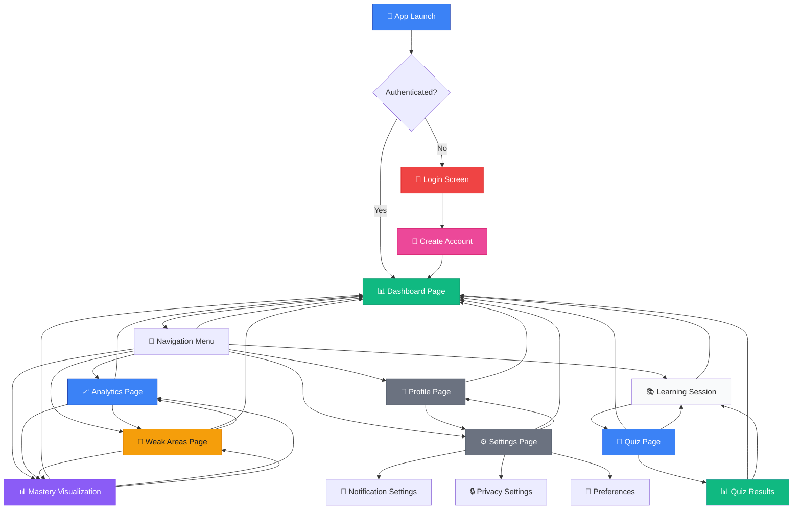
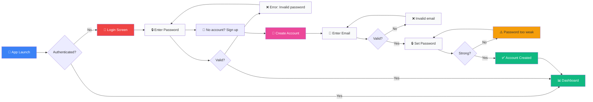
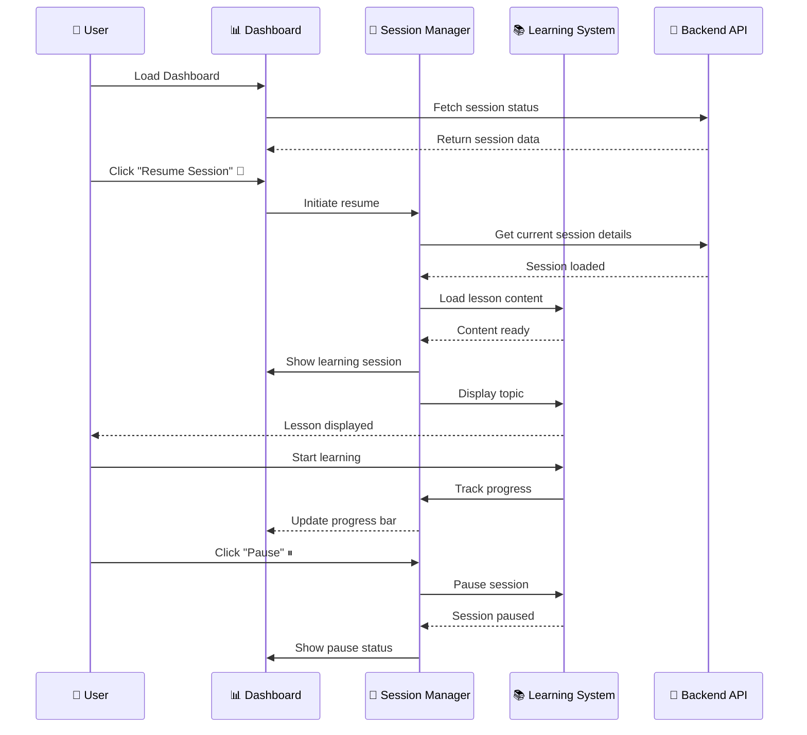
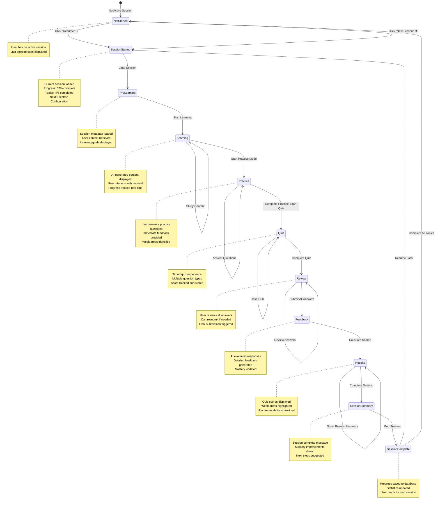
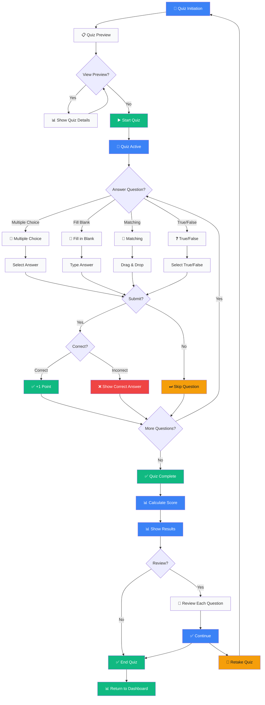
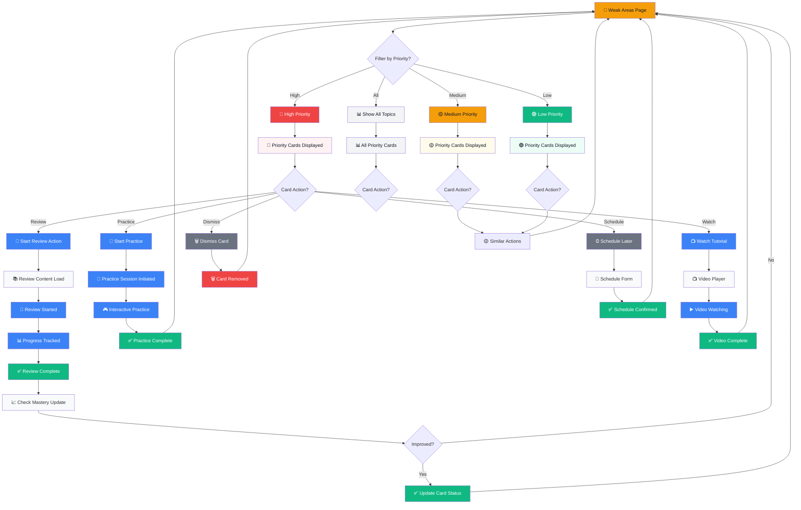
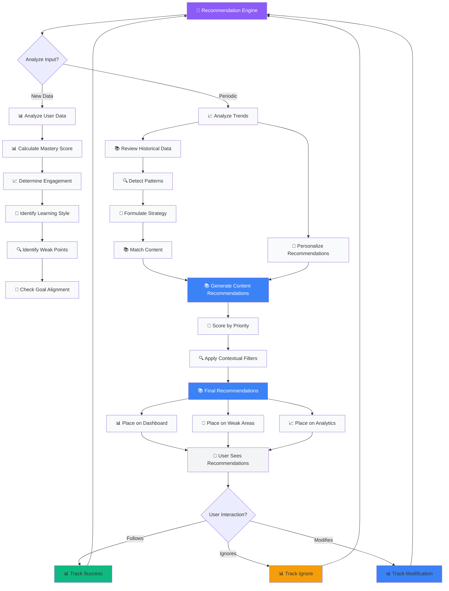
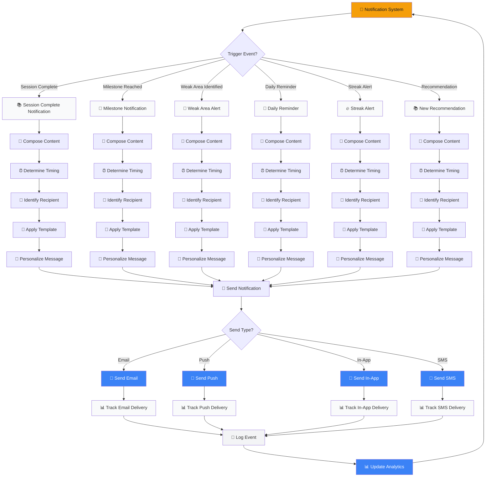
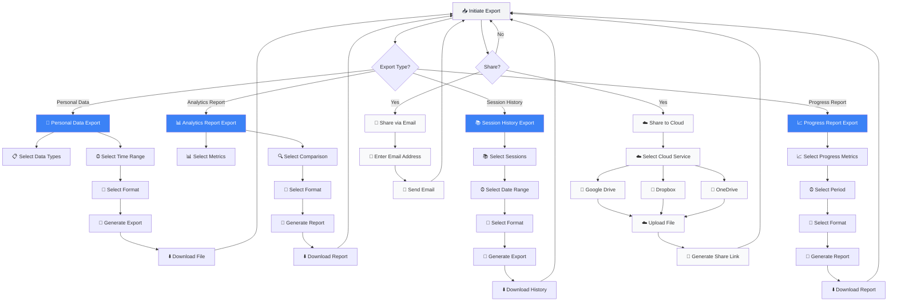
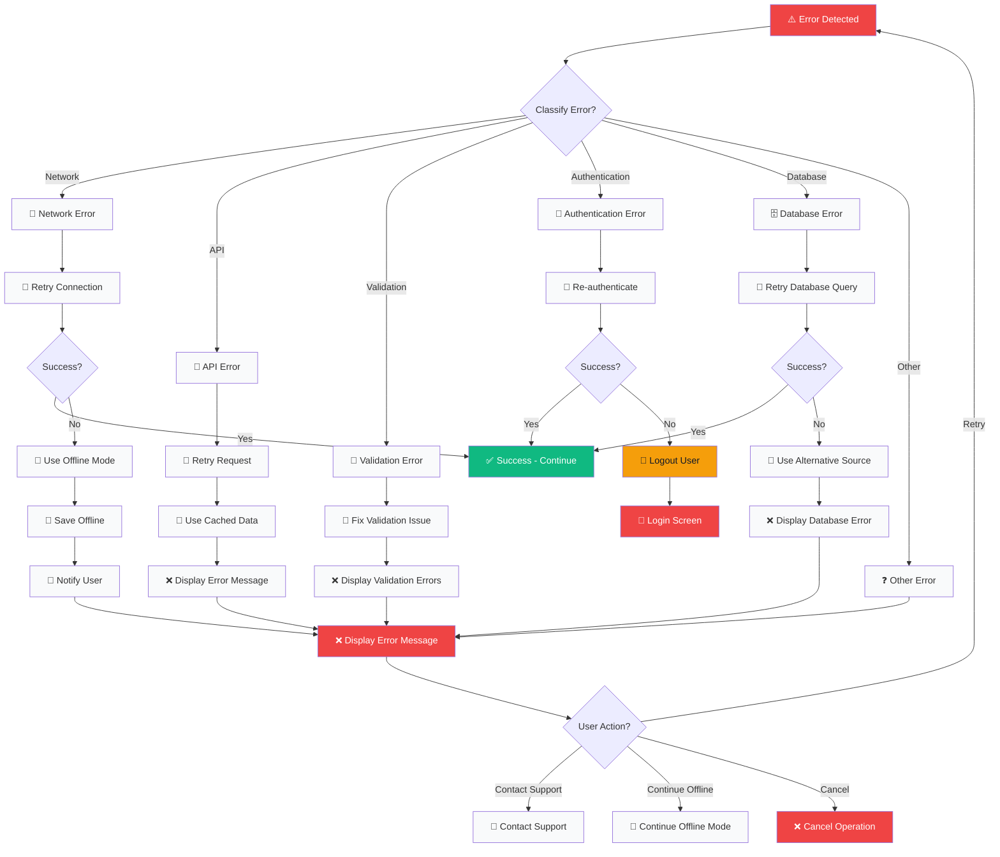

# Smart Learn - Complete Application Workflows

**Version:** 1.0  
**Date:** 2026-04-09  
**Structure:** Layered workflow documentation

---

## Workflow Layers

This document is organized into **3 layers** of workflows, each focusing on a different aspect of the application:

### Layer 1: Navigation & Core Flows
- Application navigation
- Authentication flows
- Main page transitions
- Basic user journeys

### Layer 2: Learning & Assessment Flows
- Learning session lifecycle
- Quiz workflows
- Progress tracking
- Weak areas remediation

### Layer 3: Advanced & System Flows
- Recommendation engine
- Notification system
- Data export/sharing
- Error handling

---

## Layer 1: Navigation & Core Flows

### 1.1 App Navigation Flow

### 1.2 Authentication Flow

### 1.3 Learning Session Initiation

---

## Layer 2: Learning & Assessment Flows

### 2.1 Learning Session Lifecycle

### 2.2 Quiz Workflow

### 2.3 Weak Areas Remediation Flow

---

## Layer 3: Advanced & System Flows

### 3.1 Recommendation Engine Flow

### 3.2 Notification System Flow

### 3.3 Data Export & Sharing Flow

### 3.4 Error Handling & Recovery Flow

---

## Summary Statistics

### Layer 1: Navigation & Core Flows
- 3 complete workflows
- App navigation, authentication, session initiation
- Focus: User entry and movement through pages

### Layer 2: Learning & Assessment Flows
- 3 complete workflows  
- Learning session lifecycle, quiz workflow, weak areas remediation
- Focus: Core educational functionality

### Layer 3: Advanced & System Flows
- 4 complete workflows
- Recommendation engine, notifications, export/sharing, error handling
- Focus: System-wide features and resilience

**Total:** 10 complete workflow diagrams

---

## How to Use

### View in Mermaid Live Editor

1. Copy workflow code from any section
2. Go to https://mermaid.live
3. Paste the code
4. View and interact with the flowchart

### VS Code Integration

1. Install Mermaid extension
2. Open this file
3. View preview to see interactive diagrams

---

**Version:** 1.0  
**Date:** 2026-04-09  
**Prepared by:** Eva2 AI Guardian  
**Approved by:** Jacky Chen (Master)
