# Smart Learn - Application Workflows

**Version:** 1.0  
**Date:** 2026-04-09  
**Purpose:** Complete workflow documentation for Smart Learn application

---

## APP_NAVIGATION_FLOW

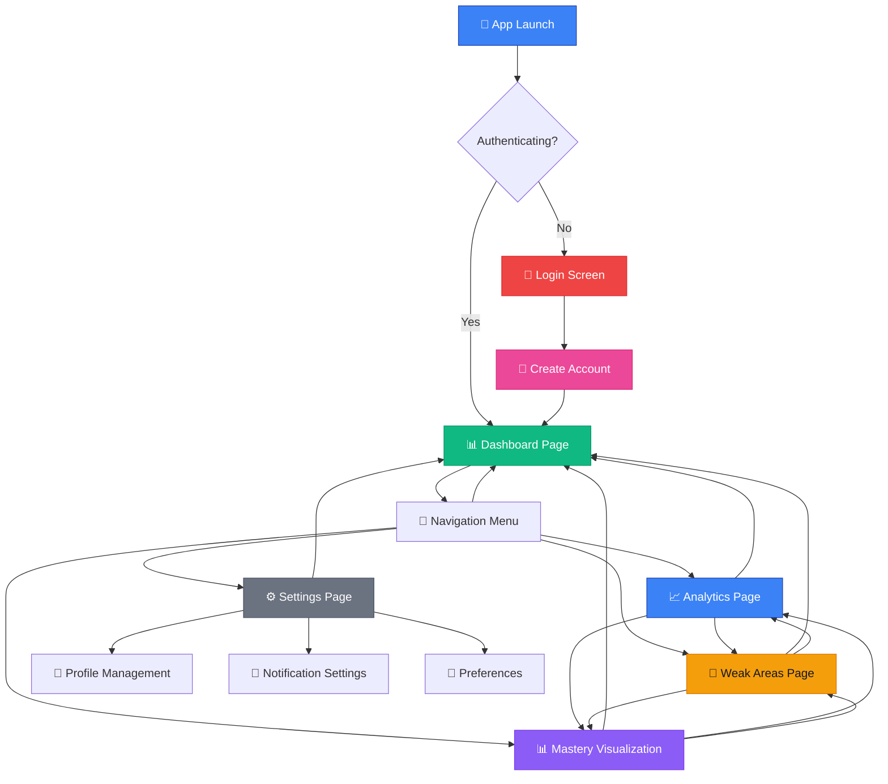

---

## DASHBOARD_INTERACTIONS_FLOW

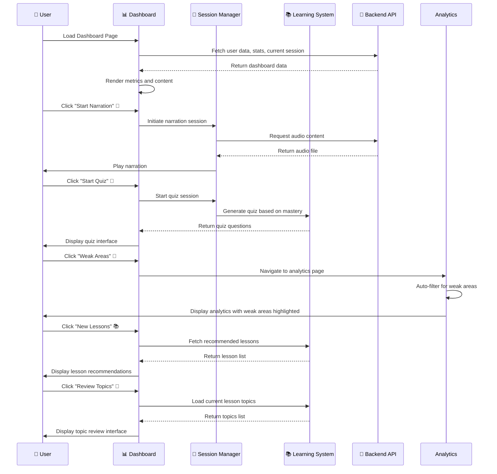

---

## LEARNING_SESSION_LIFECYCLE

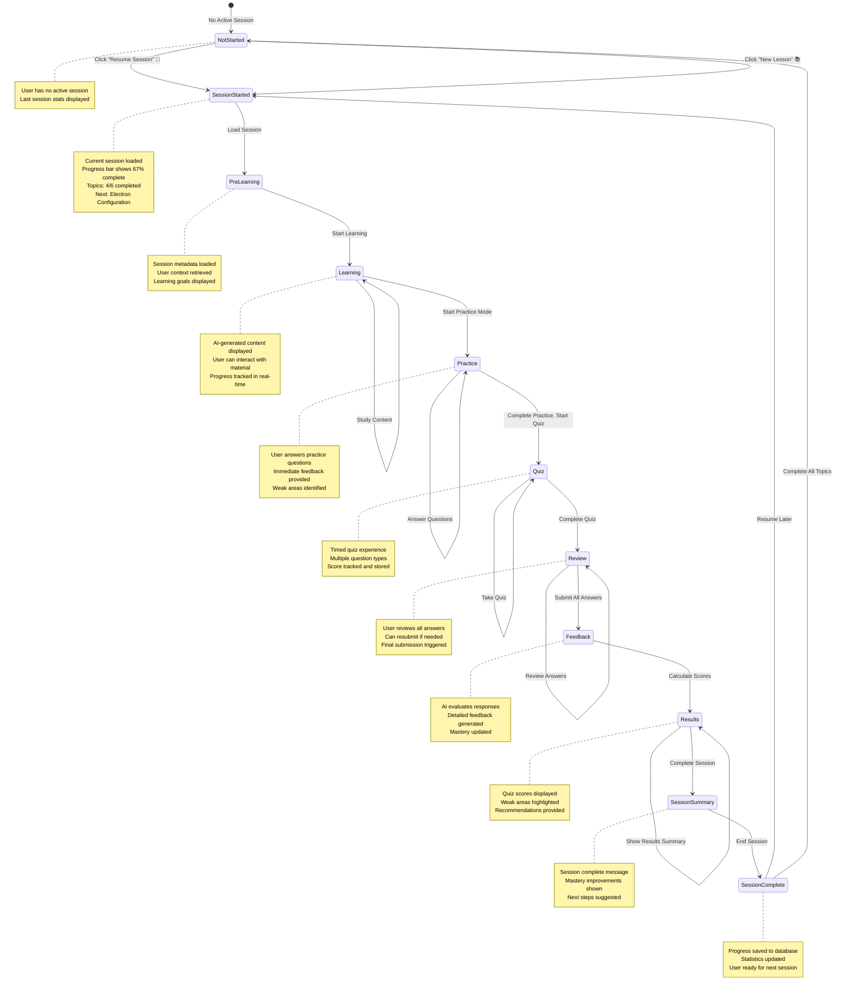

---

## ANALYTICS_NAVIGATION_FLOW

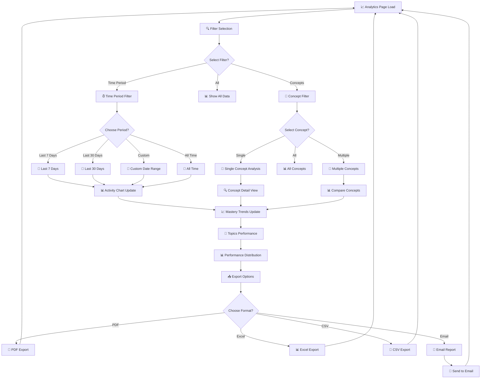

---

## WEAK_AREAS_REMEDIATION_FLOW

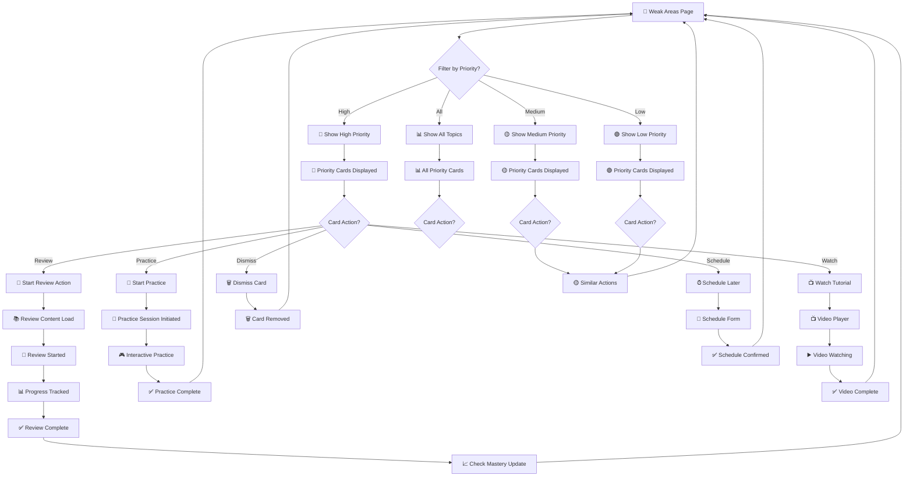

---

## MASTERY_VISUALIZATION_FLOW

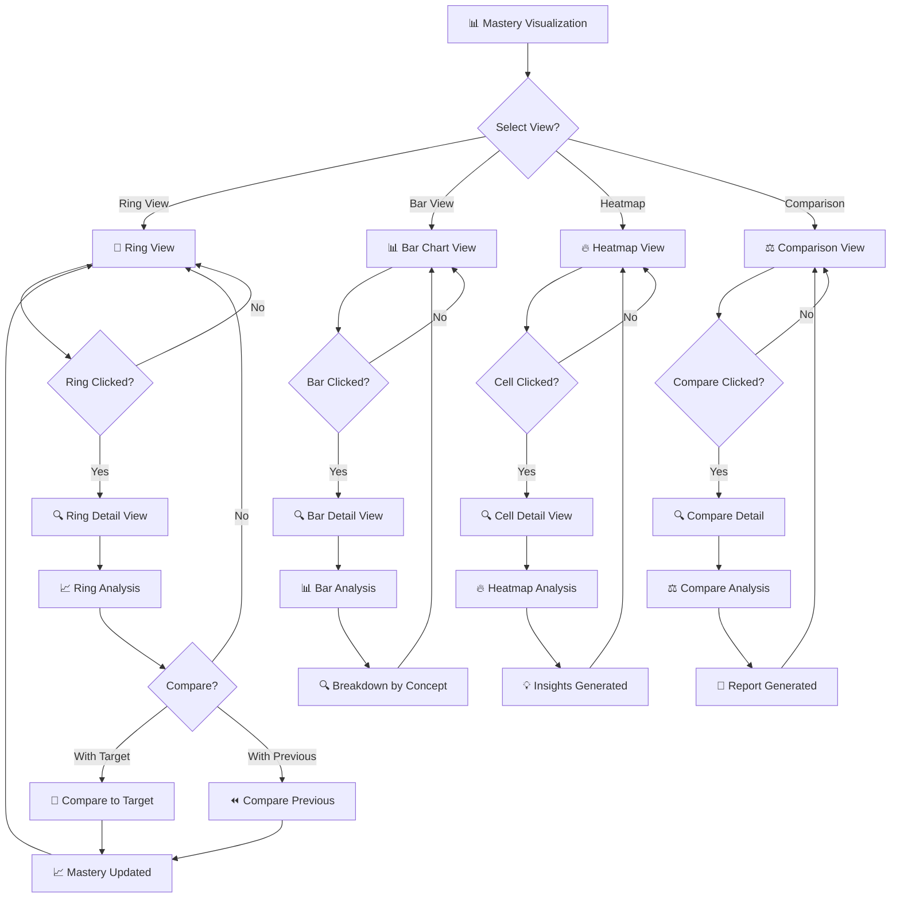

---

## SETTINGS_MANAGEMENT_FLOW

```mermaid
flowchart TD
    Settings[⚙️ Settings Page] --> AccountSettings[👤 Account Settings]
    Settings --> Notifications[🔔 Notification Settings]
    Settings --> Preferences[🎨 Preferences]
    Settings --> Privacy[🔒 Privacy Settings]
    Settings --> Integration[🔗 Integration Settings]
    
    AccountSettings --> ProfileEdit[✏️ Edit Profile]
    ProfileEdit --> ProfileView[👤 View Profile]
    ProfileEdit --> ProfileUpdate[✅ Update Profile]
    ProfileUpdate --> Settings
    
    AccountSettings --> PasswordChange[🔑 Change Password]
    PasswordChange --> PasswordConfirm[🔐 Confirm Current]
    PasswordConfirm --> NewPassword[🆕 New Password]
    NewPassword --> PasswordUpdate[✅ Update Password]
    PasswordUpdate --> Settings
    
    AccountSettings --> Subscription[💳 Subscription]
    Subscription --> PlanView[📊 Current Plan]
    PlanView --> PlanChange[🔄 Change Plan]
    PlanChange --> Payment[💳 Payment Method]
    Payment --> PlanUpdate[✅ Plan Updated]
    PlanUpdate --> Subscription
    PlanUpdate --> Settings
    
    Notifications --> NotifToggle[🔔 Toggle Notifications]
    NotifToggle --> NotifConfig[⚙️ Configure Notifications]
    NotifConfig --> EmailPrefs[📧 Email Preferences]
    NotifConfig --> PushPrefs[📱 Push Preferences]
    NotifConfig --> InAppPrefs[💬 In-App Preferences]
    EmailPrefs --> Settings
    PushPrefs --> Settings
    InAppPrefs --> Settings
    
    Preferences --> ThemePrefs[🎨 Theme Preferences]
    ThemePrefs --> ThemeToggle[🌓 Light/Dark Mode]
    ThemePrefs --> ColorPrefs[🌈 Color Scheme]
    ColorPrefs --> ThemeApply[✅ Apply Theme]
    ThemeApply --> Settings
    
    Preferences --> LanguagePrefs[🌐 Language Preferences]
    LanguagePrefs --> LanguageSelect[🌍 Select Language]
    LanguageSelect --> LanguageApply[✅ Apply Language]
    LanguageApply --> Settings
    
    Privacy --> PrivacyToggle[🔒 Privacy Controls]
    PrivacyToggle --> DataControls[📊 Data Controls]
    DataControls --> ExportData[📥 Export My Data]
    DataControls --> DeleteData[🗑️ Delete Data]
    ExportData --> Settings
    DeleteData --> Settings
    
    Integration --> APIKeys[🔑 API Keys]
    APIKeys --> KeyGenerate[🆕 Generate New Key]
    KeyGenerate --> KeySave[✅ Save Key]
    KeySave --> Settings
    
    Integration --> OAuth[🔗 OAuth Services]
    OAuth --> GoogleConnect[🔗 Connect Google]
    OAuth --> DropboxConnect[🔗 Connect Dropbox]
    OAuth --> OneDriveConnect[🔗 Connect OneDrive]
    GoogleConnect --> Settings
    DropboxConnect --> Settings
    OneDriveConnect --> Settings
```

---

## DATA_EXPORT_AND_SHARING_FLOW

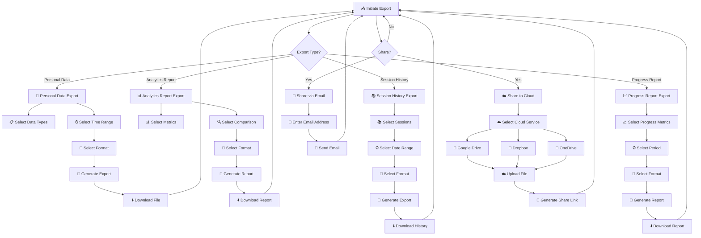

---

## LEARNING_RECOMMENDATION_ENGINE_FLOW

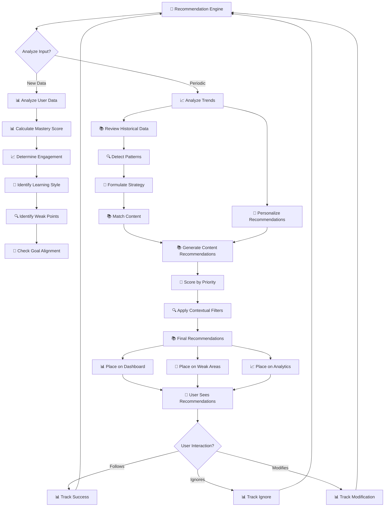

---

## NOTIFICATION_SYSTEM_FLOW

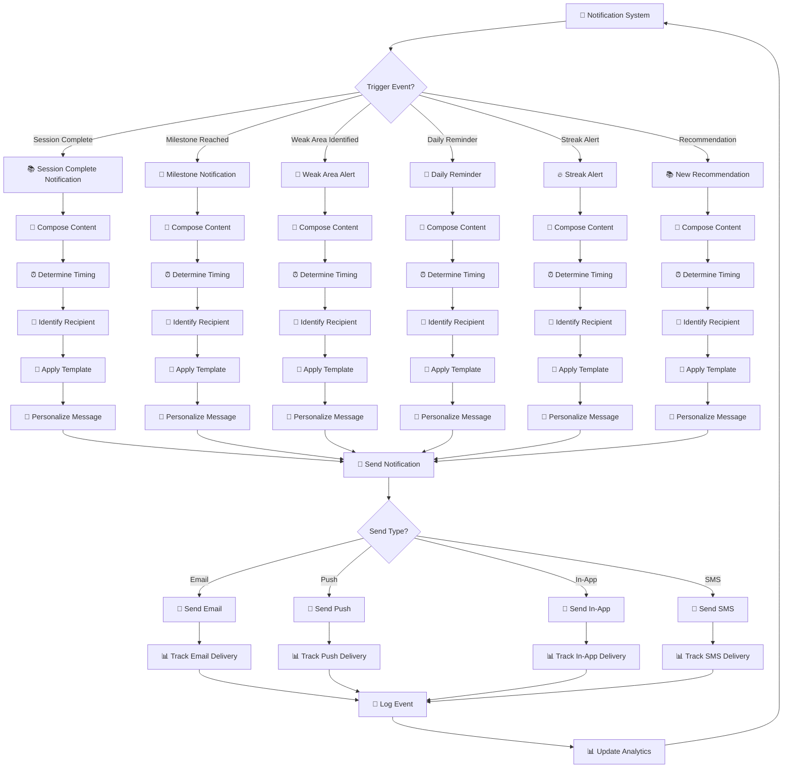

---

## ERROR_HANDLING_AND_RECOVERY_FLOW

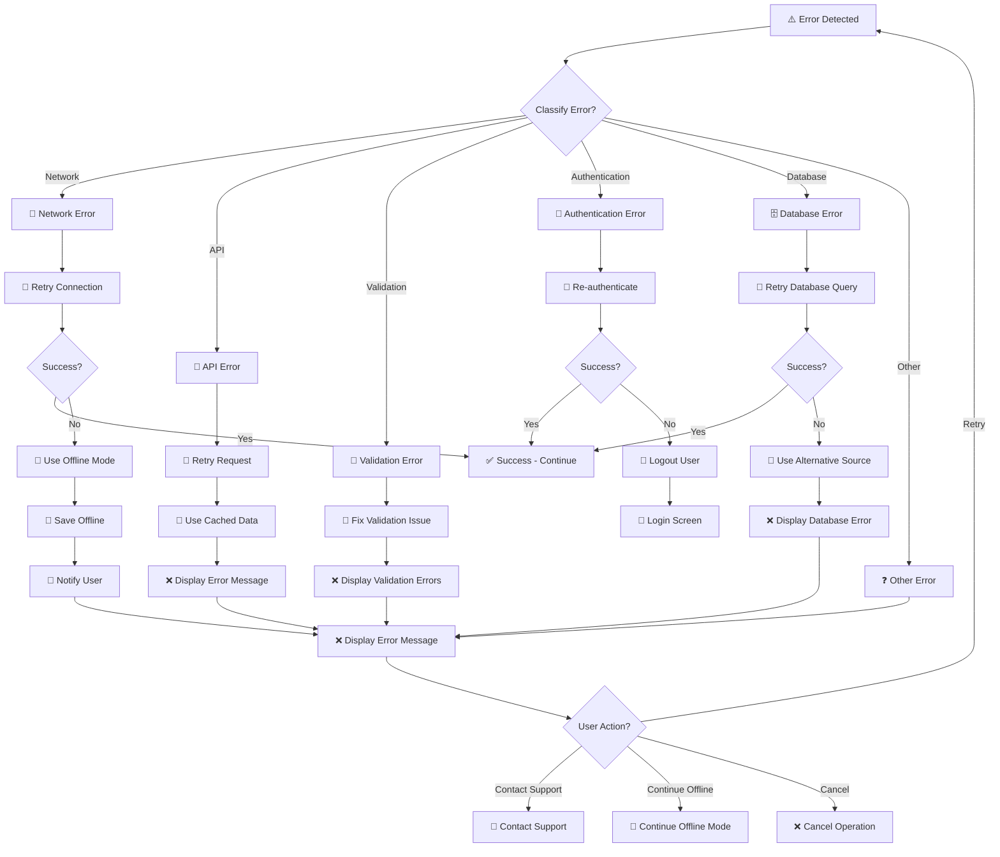

---

## HOW TO USE

### View in Mermaid Live Editor

1. Copy any workflow code block above
2. Go to https://mermaid.live
3. Paste the code
4. View and interact with the flowchart

### VS Code Integration

1. Install **Mermaid Live Editor** or **Markdown Preview Mermaid Support** extension
2. Open this file or any `.md` file with mermaid code blocks
3. Use the preview pane to view interactive diagrams

### Export Options

- **PNG**: For presentations and documentation
- **SVG**: For scalable graphics in web documentation
- **PDF**: For printable documentation
- **JSON**: For programmatic analysis

---

## LEGEND

### Icons

- 👤 User
- 🔑 Login/Authentication
- 📊 Dashboard/Analytics
- 🎯 Goals/Targets
- 📚 Learning Content
- 📝 Forms/Quizzes
- 🔍 Search/Filters
- ⏰ Time/Scheduling
- 🔔 Notifications
- ⚙️ Settings
- 📅 Calendar/Schedule
- 🎨 Preferences
- 📧 Email/Sharing
- 📡 Connection Status
- 🔄 Refresh/Retry
- ✅ Success/Complete
- ❌ Error/Failure
- ⚠️ Warning
- 🔧 Configuration/Fix
- 💾 Save/Storage
- ☁️ Cloud Services

### State Colors

- 🟢 **Green**: Success, Complete, Active
- 🟡 **Amber**: Warning, Pending, Medium
- 🔴 **Red**: Error, Critical, High Priority
- 🔵 **Blue**: Information, Default State
- 🟣 **Purple**: Special States, Premium Features

---

**Version:** 1.0  
**Date:** 2026-04-09  
**Prepared by:** Eva2 AI Guardian  
**Approved by:** Jacky Chen (Master)
